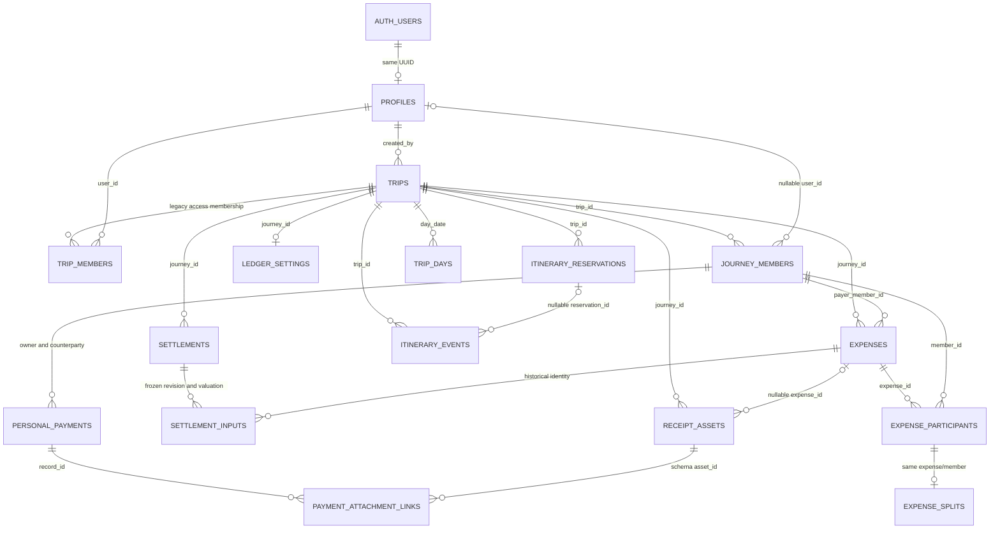
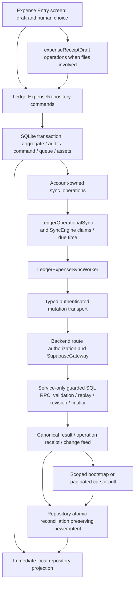

# Trip Canonical Architecture — Phase A0 Audit

- Date: 2026-10-03 (Pacific/Auckland)
- Status: **AUDIT COMPLETE — REVIEW PENDING**
- Repository: `/Users/xoery/Project/otr-mobile-canonical`
- Branch: `integration/ledger-polish-canonical`
- Audited HEAD: `4473b74cec2c831ec6e26128d6dde47b7eb7aca2`

## Scope and evidence rules

This is a repository-source audit, not a deployed-database audit. Git status was
clean before this retry. The earlier blocked attempt observed untracked
`docs/trip/` documents at HEAD `76d0535`; that is not this audit's baseline.
Only this report is changed. No database, device, network service, Production,
Hosted Dev, deployment, migration execution, or legacy Web checkout was accessed.

Instructions and foundation sources read: `AGENTS.md`,
`docs/CURRENT_IMPLEMENTATION_STATE.md`, `docs/PRODUCT.md`, `docs/ARCHITECTURE.md`,
`docs/DATA_MODEL.md`, `docs/API_CONTRACT.md`, `docs/OFFLINE_SYNC.md`,
`docs/ENVIRONMENT_AUDIT.md`, `docs/legacy/OTR_LEGACY_AUDIT.md`,
`docs/architecture/ui-foundation.md`, and
`docs/architecture/OTR_TERMINOLOGY_GLOSSARY.md`.
Historical cross-module drafts describe intended capabilities beyond current code;
implementation and checked-in migrations establish current repository facts.
The committed Trip brainstorm/design Word documents are planning material, not
proof of runtime implementation or A1 approval.

Evidence identifiers E01–E30 below resolve to exact paths, symbols, tables and
tests. **CURRENT FACT** means confirmed in this HEAD's source/schema declarations;
it does not certify remote deployment or live data. **INFERENCE** is labeled.
**RECOMMENDATION** is confined to classifications and future boundaries.
Searches covered repository text, including domain/API/repository/schema/UI/native
and script inventories. Binary brainstorm documents and ignored generated native
build outputs were not treated as application code. Absence claims are scoped to
checked-in Mobile/Backend/schema contracts, not to external services or legacy Web.

## A. Executive summary

**CURRENT FACT.** The server's Journey container is `public.trips`, not a
`journeys` table. Ledger 2.0 refers to its UUID as `journey_id` while HTTP paths
retain `/trips/:tripId`. Mobile's general `Trip` type is a draft-shaped type and
`createTripRepository()` returns no data. The operational Journey projection is
Ledger-owned: Backend combines `trips`, `ledger_settings`, `journey_members`, and
actor capabilities; SQLite persists `ledger_journeys`, `ledger_members` and
account-scoped actor context. This is a traceable partial projection, not two
independent competing authoritative Journey roots. [E01–E04]

Strong reusable foundations are transactional local writes, durable account-owned
commands, authenticated typed transport, protected reconciliation, scoped cursors,
offline session bootstrap, immutable financial evidence and explicit correction
lineage. Those capabilities are implemented most fully for Ledger. The Trip tab
still exposes the Phase 2B itinerary-create harness; Today/Capture are foundation
surfaces. There is no complete Mobile Trip planner or root Journey CRUD. [E08–E13]

Identity distinctions already exist but are uneven. An unlinked Journey Member
can participate in an Expense without an account. Expense Participant is an
Expense-specific membership snapshot keyed by `(expense_id, member_id)`, not an
independent person registry. `trip_members` and `journey_members` coexist with
different permissions and semantics. Creator/read access does not imply an
eligible Ledger actor or Organizer finalization rights. [E05–E07, E14]

The largest migration risks are Member-ID replacement, loss of financial
history/finality, automatic movement of Journey currency, conflation of the two
membership authorities, and treating narrow local itinerary records as lossless
copies of rich server events/reservations. Local itinerary date/time is converted
to a UTC timestamp, absent start time becomes midnight plus an estimated flag,
and server temporal/location/reservation richness is not mirrored. [E06–E08,
E15–E20]

Artifacts are not a generalized Trip resource. Expense receipts have one Expense
target; Personal Payment attachment links add a separate association, but the
Backend uses the asset UUID as the link primary key and Mobile caches one payment
target per asset. Do not infer arbitrary many-object reuse from that join table.
Real offline image OCR exists; the default Backend OCR provider is a null-result
stub, not a remote extraction service. [E21–E24]

**RECOMMENDATION.** Evidence is sufficient for an A1 **design-only** review of
identity, root authority, temporal/location semantics and migration contracts.
This is not permission to implement A1. No unresolved competing root authority
or live corruption was established. Remote drift, provider identity merging,
member departure/cache revocation, and some cross-object attachment behavior
remain explicit unknowns. A0 acceptance and A1 authorization require human review.

## B. Current domain map



Logical names `PERSONAL_PAYMENTS` and `PAYMENT_ATTACHMENT_LINKS` denote
`personal_settlement_payment_records` and `personal_settlement_payment_attachments`.
This diagram shows declared schema relationships; the receipt/link cardinality
is constrained more narrowly by the current API (section C.4).
It omits secondary audit/valuation/Review/household relations for readability.
Evidence: E01, E05, E06, E14, E17, E21, E22.

Terminology at this HEAD:

| Term               | Current use                                                      | Boundary                                                                    |
| ------------------ | ---------------------------------------------------------------- | --------------------------------------------------------------------------- |
| Trip               | Product tab/module; draft `Trip`; server `trips`; HTTP scope     | Not a second implemented root aggregate.                                    |
| Journey            | Ledger scoped container/context; `journey_id`                    | Resolves to `trips.id`, not an automatic conceptual renaming.               |
| User/Auth          | Supabase authenticated subject and local account identity        | Not a Member or Participant ID.                                             |
| Profile            | `profiles.id` references `auth.users.id`                         | One record per auth UUID; not a provider-independent business-user mapping. |
| Member             | `journey_members`; also legacy `trip_members`                    | Different tables, roles, and access paths.                                  |
| Participant        | Expense membership snapshot; legacy itinerary participation rows | Not a standalone cross-module Participant entity.                           |
| Owner / Organizer  | Persisted role `owner`; capability adapter calls it Organizer    | Does not collapse creator, payer, asset owner, or profile admin.            |
| Creator            | `trips.created_by`, Expense user/member attribution              | Creator access can exist without linked Ledger membership.                  |
| Payer / payee      | Expense payer or Settlement transfer endpoints are Member IDs    | Personal Payment owner additionally binds user identity.                    |
| Viewer / Traveller | Product/display vocabulary; `guest` is a stored member role      | No separate persisted Viewer/Traveller role established.                    |

Evidence: E01, E05–E07, E14, E25. The glossary explicitly separates Trip/Journey,
Member/Participant/User, and Owner/Organizer; display translation is not schema authority.

## C. Local/server persistence map

### C.1 Authority and root lifecycle

| Entity                    | SQLite / file / memory                                                                                | Server declaration / authority                                                            | Mismatch or limit                                                                                                                                |
| ------------------------- | ----------------------------------------------------------------------------------------------------- | ----------------------------------------------------------------------------------------- | ------------------------------------------------------------------------------------------------------------------------------------------------ |
| Journey root              | `ledger_journeys` financial/title/date projection; summary fallback                                   | `trips` identity/name/destination/dates/creator; `ledger_settings` financial settings     | No local generic `trips` table or functioning root repository. Destination/cover/creator/storage flags absent from Ledger Journey DTO. [E01–E04] |
| Account/Profile           | SecureStore sessions; `AccountIdentity`; no full Profile mirror                                       | `auth.users`, `profiles`                                                                  | Local display identity derives from session metadata; not the complete profile. [E05, E12]                                                       |
| Access membership         | `ledger_actor_context(user_id,journey_id)`; `ledger_members` projection                               | `trip_members`, `journey_members`, creator access                                         | Mobile member rows omit `user_id`, invitation fields, linked-at, notes, avatar. [E03, E05, E07]                                                  |
| Itinerary                 | `itinerary_items`                                                                                     | `itinerary_events` via v1 create                                                          | Local/server IDs distinct; response version 1; no rich bootstrap/pull/edit/delete. [E08–E10]                                                     |
| Reservation/day/places    | No corresponding Mobile tables                                                                        | `itinerary_reservations`, `trip_days`, `places`                                           | Retained schema, not Mobile planner implementation. [E17–E20]                                                                                    |
| Expense                   | Compatibility `expenses`; canonical `ledger_expenses` and child family                                | Compatibility `ledger_entries`; canonical `expenses`, participants/splits/snapshots/audit | Same table word `expenses` names different local/server generations. [E06, E09, E14]                                                             |
| Settlement/payment        | `ledger_settlements`, inputs/balances/transfers/payments/discharges/exports; personal-payment mirrors | `settlements` family; `personal_settlement_payment_records` and grants/audit              | Personal mirrors and shared financial caches have different account rules. [E14–E16]                                                             |
| Review                    | Findings/visibility/decisions/actions/personal review cache                                           | Findings, eligible users, decisions, append-only actions/checkpoints                      | Observation is shared; decision/eligibility is personal. [E16]                                                                                   |
| Receipt                   | `ledger_receipt_assets`, `ledger_asset_operations`; app files/drafts                                  | `receipt_assets`; private `ledger-receipts` bucket                                        | Local URI is not remote object key; upload/deletion state survives screens. [E21–E23]                                                            |
| Legacy media/capture/jobs | No equivalent operational Mobile mirror                                                               | `media_assets`, variants, capture/parser/AI/background tables                             | Existing schema does not prove active workers in this Backend. [E19, E24]                                                                        |
| Selection/drafts          | `account_local_state`; screen refs/state; temporary receipt files                                     | Selection is device/account-local                                                         | Trip harness A/B selection is independent from Ledger selection. [E04, E08, E25]                                                                 |

`trips.id` is a server-generated UUID; Ledger uses it unchanged locally as
`journey_id`. No root public slug, separate local Journey-create ID, archive flag,
business lifecycle status, `deleted_at`, `updated_by`, or `updated_at` is declared
on `trips` in the baseline. It has `created_at`, `created_by`, nullable dates and
destination. No later checked-in root-table migration establishes such fields.
Root creation adds creator records to both membership tables through
`on_trip_created_add_creator` and `on_trip_created_add_journey_creator`.
Root CRUD is represented by baseline RLS/SQL, not by a working Mobile CRUD flow.
Root deletion is hard deletion in the baseline; related Ledger restrictions and
immutable triggers mean this is not proof that a financially populated Journey
can actually be deleted successfully. No archive/restore action was found. [E01, E05, E14]

Lifecycle presentation is derived separately by
`src/features/ledger/dashboardPresentation.ts:journeyLifecycleLabel`: future start
means Upcoming, elapsed end means Past, and two enclosing dates mean Active;
otherwise it returns null. `journeyPickerSections` omits null lifecycle, missing
actor/empty membership and development-pattern titles by default; Active sorts
selected first then end/name, Upcoming by start/name, Past by descending end/name.
This differs from the partial-date candidate rule and is not a persisted lifecycle.
The entry policy accepts a valid explicit/manual ID even outside the active date
window; that does not mean every undated Journey is offered by the picker. [E04]

Journey currency authority is `ledger_settings.settlement_currency` and scale,
not `Trip.baseCurrency` or legacy `journey_ledgers.base_currency`.
`readLedgerBootstrap` falls back to NZD/2/REFERENCE_RATE when settings are absent;
that fallback does not establish a stored setting. `ledger_guard_journey_currency`
requires the dedicated command and prevents changes after finalized history.
`JOURNEY_CURRENCY` change projection updates Mobile's financial context. [E03, E15]

### C.2 Existing plan primitives and exhaustive concept disposition

| Searched concept                      | Actual evidence                                                                                        | Current disposition                                                                                                       |
| ------------------------------------- | ------------------------------------------------------------------------------------------------------ | ------------------------------------------------------------------------------------------------------------------------- |
| Itinerary/item/activity/event         | `ItineraryItem`, SQLite `itinerary_items`; server `itinerary_events.event_type`                        | Real narrow create slice plus rich retained server schema.                                                                |
| Reservation/booking/confirmation      | `itinerary_reservations`; event `reservation_id`, `booking_reference`; reservation `confirmation_code` | Real schema; no Mobile reservation repository/API/UI. Booking is not an implemented separate new Mobile aggregate.        |
| Accommodation/hotel/stay              | Reservation type `hotel`, event type `hotel`, start/end timestamps                                     | Category/legacy persisted reservation capacity; no stay domain or local multi-day semantics.                              |
| Flight/train/car/ferry/tour/transport | Reservation-type checks; event `flight/car/transport`                                                  | Real server classifications; no origin/destination/zone-aware Mobile transport aggregate.                                 |
| POI/place/map/route                   | `places`, `journey_map_objects` types `poi`, `route_point`, `booking`, `plan_item`                     | Retained spatial schema; no active Mobile geocode/router/map repository. `route_point` is not proof of a route aggregate. |
| Day plan                              | `trip_days(day_date,order_index,notes)`; nullable event/reservation `trip_day_id`                      | Server grouping primitive; absent local planner.                                                                          |
| Note                                  | Local itinerary `notes` → server event `description`; event type `note`                                | Real field/classification, no standalone Mobile Note aggregate.                                                           |
| Checklist                             | No typed/persisted Mobile/Backend checklist contract found                                             | Planned/unknown external capability; do not claim implemented.                                                            |
| Flexible item/block                   | Optional local start time and server `is_estimated_time`                                               | Partial time uncertainty only; no flexible-span model.                                                                    |
| Candidate/pool/saved idea             | OCR candidate tags, Journey-entry candidates; schema confidence/needs-review                           | These are not a Trip candidate/pool lifecycle. No persisted Trip pool entity found.                                       |
| Ticket/credential                     | Expense category `ticket`; reservation confirmation; planned `TravelDocument` in draft docs            | No Mobile TravelDocument/Credential table, parser, cache manifest or repository. A PDF receipt is not a ticket domain.    |
| Prototype/demo                        | `ledger-prototype` provider/fixtures; Phase 2A/2B and diagnostic routes                                | In-memory Ledger prototype and real narrow validation slices; neither a canonical Trip planner.                           |

Evidence: E08–E10, E17–E20, E24–E26. Repository-wide text searches used the
requested vocabulary and then inspected schema/type/route bodies, not filenames
alone. `docs/legacy/OTR_LEGACY_AUDIT.md` describes legacy Web capabilities; this
audit did not reopen Web source or infer deployed Web behavior from Mobile.

### C.3 Time and location

| Representation               | Actual semantics and assumptions                                                                                                                                                                             | Future constraint                                                                                                                                     |
| ---------------------------- | ------------------------------------------------------------------------------------------------------------------------------------------------------------------------------------------------------------ | ----------------------------------------------------------------------------------------------------------------------------------------------------- |
| Journey dates                | `trips.start_date/end_date` are nullable SQL dates; local strings. `isJourneyCandidate` compares date strings inclusively; partial bounds permitted; no bounds means not a candidate.                        | No persisted active/upcoming/past state. Explicit/manual entry and picker visibility are separate rules. Preserve both.                               |
| Ledger today/period          | `LedgerStage6Screen.localToday` uses device calendar; `myLedgerPeriodBounds` uses local calendar for year start then ISO UTC bounds; 30D uses elapsed milliseconds.                                          | Device time affects chooser/report windows, not one authoritative Journey zone.                                                                       |
| Local itinerary              | Required `scheduledDate`; nullable free-text `startTime`; sorted by scheduled date then creation time, not start time/order index. Date regex alone checks shape. Server contract additionally checks HH:mm. | One day per local item; no end, duration, all-day enum, IANA zone or multi-day contract.                                                              |
| Server create mapping        | `createItineraryItem` constructs `scheduledDate + T + (startTime ?? 00:00) + :00.000Z`; missing time sets `is_estimated_time`.                                                                               | A wall-clock entry is encoded as UTC without zone conversion. Missing time is not proven all-day semantics.                                           |
| Retained events/reservations | `planned_start/planned_end`, `starts_at/ends_at` are timestamptz; optional trip-day date                                                                                                                     | Can store spans/instants; no explicit per-endpoint time zones or local all-day rules declared. Not losslessly mirrored.                               |
| Expense                      | Required `occurred_at` timestamptz; nullable `economic_date` SQL date; explicit evidence completion                                                                                                          | A timestamp is not evidence of intended economic day. Do not infer missing dates in a Trip migration.                                                 |
| Personal Payment             | `occurredAt`, explicit `economicDate`; provenance `EXPLICIT/LEGACY_DERIVED_UTC/null`; compatibility derivation remains                                                                                       | Original payment/economic day and read-only FX projection differ.                                                                                     |
| FX/history                   | Rate effective/reference/economic date; observed/accepted timestamps; Settlement `through_timestamp/sourceAsOf/finalized_at`                                                                                 | Do not replace financial cutoff with Journey date span or reinterpret immutable historical inputs.                                                    |
| Other retained schema        | `trip_days.day_date`; legacy Ledger `expense_date/start_date/end_date`; capture `captured_at/timezone`; media `taken_at`                                                                                     | A capture timezone field does not imply a Journey timezone. Some SQL defaults/validation use `CURRENT_DATE`. Deployment session timezone not checked. |

Evidence: E04, E08, E10, E14–E18, E27. No single Journey-timezone field was found.
Future multi-day stays, cross-zone flights/transport and flexible blocks cannot be
assumed supported by the Phase 2B contract; server spans alone do not prove their
business interpretation.

Location facts [E01, E08, E19, E20]:

- Journey destination is free-text root business data, not a resolved Place ID;
  operational Ledger Journey projection drops it.
- Local itinerary location is nullable text and is displayed directly. Backend
  duplicates it into event `location_name` and `location_text`; no geocoding is
  required for this write.
- Retained events/reservations/maps/media have latitude/longitude, resolution
  status, confidence, manual flag, provider/place ID, error/attempt count and
  geocoded-at. `places` includes address, city/region/country, raw query/response
  and verification time: provider enrichment/cache, distinct from supplied text.
- `journey_live_locations` stores user coordinates/accuracy/time/live flag;
  capture has GPS JSON and media has EXIF GPS. No current Mobile location
  tracking or map-launch path was established.
- Server canonical Expense declares `location_snapshot` JSON; current editable
  DTO/local Ledger schema do not expose a corresponding location field.
  Legacy `ledger_entries` retains address/coordinates/provider resolution.
- Legacy storage schema contains Drive/provider metadata. Current Mobile Trip
  creation path has no required Google/Apple location-provider match. Native
  Apple Vision is OCR infrastructure, not a maps provider.

### C.4 Attachments, import and processing

Receipt flow: native Camera/Photos/Files selection → account-owned temporary file
→ MIME sniff/size/hash/image preparation → repository transaction with Expense
and asset upload intent → receipt worker after Expense server identity exists →
authenticated Backend create/content/upload-complete/link → private storage.
Metadata stores Journey, nullable Expense, uploader, object path/provider, MIME,
size, SHA-256, upload/OCR states and revision. Local cache stores URI and source
metadata; bytes can remain offline. Upload failure preserves the locally saved
Expense and original. Metadata being cached does not mean bytes are present.
Eviction requires authenticated canonical HEAD plus fresh GET/hash verification;
unrecoverable originals remain protected. [E21–E23]

Expense multi-file limit is three active assets, guarded locally and by
`ledger_limit_expense_attachments`; deletion records immutable tombstone intent,
syncs it and retains remote bytes/metadata. Tombstoned Expense assets cannot be
restored/reparented through that SQL limit trigger. Read authorization follows
Journey/Expense access, not solely uploader identity; upload ownership remains
`created_by` (direct `auth.users` FK). [E21, E23]

**Can one artifact associate with multiple objects?** The answer is bounded:
`receipt_assets.expense_id` supports at most one Expense, and `linkReceipt`
rejects a different target. The Personal Payment association table additionally
references `asset_id`; its SQL pair index is not a unique asset index, and its
validation does not exclude an Expense-linked asset. The current Backend inserts
`id = receiptId`, so the API cannot create multiple Personal Payment association
rows for that same asset UUID, and SQLite holds a single `personal_payment_id`.
Thus schema capacity is wider than client/API capacity; no generalized reusable
Artifact-to-many-business-objects contract exists. Expense plus Personal Payment
cross-link behavior is not proven by an end-to-end test in this audit and is
UNKNOWN as a supported product flow. Legacy `media_assets`/`capture2_media_uploads`
have other links but are not this receipt system. [E21, E22]

| Infrastructure      | Proven current implementation                                                            | Reuse assessment (recommendation)                                                                                                    |
| ------------------- | ---------------------------------------------------------------------------------------- | ------------------------------------------------------------------------------------------------------------------------------------ |
| Image OCR           | iOS `ReceiptOcrModule`/Apple Vision; validated observations/boxes/languages/cancellation | Potential reusable image text-recognition adapter; not a booking extractor.                                                          |
| Parsing             | `parseReceipt`, parser B1/B2/B3, evidence sets                                           | Receipt-specific amount/currency/title ranking; do not declare general travel parsing.                                               |
| Structured preview  | Expense Receipt Review and scan-session drafts, confirm-only field transfer              | Human confirmation pattern reusable; field model/merge rules remain Expense-specific.                                                |
| PDF                 | Files import, MIME sniff, size validation, preview/storage                               | Real attachment ingestion; no real current PDF-to-booking parser. Default Backend OCR returns nulls (fixture returns canned values). |
| Camera/Photos/Files | Installed Expo pickers in Expense entry                                                  | Real native input capabilities, not a global Capture pipeline.                                                                       |
| Share Sheet         | Expo Sharing/export use is outbound; no inbound Share Extension/URL import handler found | Inbound import not established.                                                                                                      |
| Email/URL/AI import | Baseline capture/parser/prompt/AI/background-job schemas; foundation Capture route       | Retained schema/planned concepts, no operational Mobile import job or general AI extraction service found.                           |
| Background          | Durable receipt workers and app lifecycle sync                                           | Retry/upload lifecycle reusable; not proof of OS-managed general import processing.                                                  |

Evidence: E21–E24, E26. No remote parser/provider or schema table was exercised.

## D. Current mutation/sync path



This is the current path, not a proposed Action Layer. Expense UI invokes
repositories/operation helpers; `expenseIntent` provides typed commands and
group patches. Repositories persist and enqueue; workers/transport execute.
The application does **not** have a universal cross-domain Action dispatcher.
Personal Payment uses its own repository/coordinator/worker; Review uses
repository/coordinator/actions; Settlement previews/confirmations use
`useStage7Settlement` and `ledgerSettlementCoordinator`, with immutable results
projected into the Settlement repository. Not every action is an offline local
financial write: finalization requires a current authoritative server source.
Conflict refresh is a repository network read; conflict decisions queue immutable
resolution requests. [E11, E13, E16, E28]

Itinerary is separately narrower:
`ItinerarySliceScreen → useItinerarySlice → createItineraryItem → SQLite item +
CREATE_ITINERARY → runItineraryDemoSync → SyncEngine/ItinerarySyncWorker →
fake transport OR v1 authenticated Dev transport → itinerary_events → same local
row serverId/version reconciliation`.
The coordinator is an explicit demo harness, forces ONLINE engine state and uses
linear retry scheduling; it is not evidence of complete itinerary operational
sync. There is no itinerary pull/tombstone/correction contract. [E08–E10]

Ledger details that future Trip work must preserve [E11–E13, E28–E30]:

- Data and outbox insert atomically; local/server IDs are kept separately.
- Expense command payload/key become immutable after binding/attempt; successors
  wait for causal APPLIED receipts. An unattempted create may compact current intent.
- Due-time selection, process claim/lease, interrupted recovery and exponential
  jitter followed by sparse retries belong to the queue/engine. 401 pauses;
  409 preserves conflict; known permission/validation failures are actionable.
- Scoped cursors bind version/Journey/user; invalid cursor uses controlled
  scoped bootstrap, not a global wipe. Pages and checkpoints apply transactionally.
- Canonical pull and mutation reconciliation retain newer pending intent,
  tombstones, conflict evidence, and monotonic server baselines.
- Account generation invalidates in-flight views/steps; selected Journey,
  personal summaries/Review/payment projections/cursors are account scoped.
  Confirmed shared Journey data uses cached actor access; unsynced rows/queue
  intent use local owner identity.
- `bootstrapApplication` opens SQLite and local session before non-blocking
  resume/health. Token expiry does not itself remove offline access.

No permission is inferred from a local owner column alone. The itinerary
repository filters unsynced ownership but permits SYNCED rows without Ledger's
actor EXISTS check; account isolation of that compatibility slice is therefore
narrower than canonical Ledger. Revoked membership/offline cache-lock policy is
not proven complete (section J).

## E. Identity/member matrix

| Concept                             | Current representation                                   | Canonical ID                       | Can exist independently?                                  | Used by                                                  | Evidence |
| ----------------------------------- | -------------------------------------------------------- | ---------------------------------- | --------------------------------------------------------- | -------------------------------------------------------- | -------- |
| Auth User                           | Supabase `auth.users`; JWT `sub`; local identity/session | Auth UUID                          | Without Journey/expense participation, yes                | Authentication, actor/audit/storage ownership            | E05, E12 |
| Profile                             | `profiles`                                               | Same auth UUID                     | Not without Auth FK; Member need not reference one        | Names, role/admin, financial actor attribution           | E05      |
| Legacy access member                | `trip_members(trip_id,user_id,role)`                     | Row UUID + unique trip/user        | Without `journey_members` row, schema permits             | Access checks and legacy RLS                             | E05, E07 |
| Journey Member                      | `journey_members`; local `ledger_members`                | Stable Member UUID                 | Without authenticated User, yes (`user_id` nullable)      | Expense payer/participant, households, transfers, Review | E05, E06 |
| Expense Participant                 | `expense_participants`; `ExpenseParticipant`             | Expense UUID + Member UUID         | Without Auth yes; without Member no                       | Consumption shares and splits                            | E06, E14 |
| Itinerary participant               | Event/reservation participant tables                     | Row UUID; nullable User/Member FKs | Legacy schema has both nullable links                     | Retained itinerary schema only                           | E17      |
| Expense payer                       | `payer_member_id`                                        | Member UUID                        | Without Auth yes; Member required                         | Expense/financial validation                             | E06      |
| Personal Payment owner/counterparty | User + owner Member + counterparty Member                | Payment UUID; member/user bindings | Owner requires linked User/Member; counterparty is Member | Personal financial record and authorization              | E14      |
| Settlement endpoints                | Member balances/transfer from/to                         | Member UUID                        | Unlinked Member can be a financial endpoint               | Final obligation and repayment history                   | E14, E15 |
| Invite/placeholder                  | `journey_invites`; Member invite email/code/name/status  | Invite UUID/token and Member UUID  | Without claimed User, yes                                 | SQL accept/claim flows; no Mobile invite CRUD            | E05      |

Explicit answers:

1. **Participant without Auth User: YES.** Expense participants reference a
   Journey Member whose `user_id` may be null; there is no participant auth FK.
2. **Auth User can belong without an Expense Participant: YES.** Participation
   is Expense-specific. Without a Journey Member row, legacy `trip_members` or
   creator access can still authorize reads; bootstrap then returns null actor
   Member/capabilities. No trigger on every `trip_members` insert ensures a
   corresponding Journey Member. [E03, E05, E07]
3. **An unlinked Member can later link to a User: YES, SQL capability.**
   `claim_journey_member` updates the same Member ID, sets linked-at/status and
   inserts legacy membership; guards reject another claimed identity or another
   Member already assigned to this User/Journey. Email claim/invite routines
   also exist. No standalone Expense Participant-to-User link operation exists.
4. **Ledger reuses Participant identity: it reuses Member IDs.** Participant
   identity is the Expense/Member pair; splits, payer, household and transfer
   endpoints all reference the Journey Member. [E06]
5. **Direct auth-user business dependencies: YES.** Actor/provenance and private
   ownership deliberately use user/profile IDs; legacy itinerary participant
   tables also carry `user_id` beside `journey_member_id`, and live locations/
   ratings are user-keyed. These are actual mixed identity contracts, not proof
   that every user FK should be replaced. [E05, E14, E17, E20, E21]
6. **Multiple auth identities for one business User: UNKNOWN.** Mobile keys
   accounts by auth UUID; no separate person/business-user alias/merge registry
   was found. Multiple provider identities mapping to one Auth UUID depends on
   provider configuration outside this repository-source audit.
7. **Member leaves: no canonical Mobile leave command found.** SQL
   `remove_journey_member` deletes legacy membership, records a removed-user
   marker, optionally revokes email invites, prevents last-owner removal, then
   physically deletes the Member. With financially referenced Members, RESTRICT
   FKs reject the deletion and the function transaction rolls back. Do not claim
   successful access revocation if the final delete is rejected. Removing a
   creator also does not erase `trips.created_by` access. [E05–E07, E14]
8. **Participant deletion:** the declared Expense-participant FK cascades its
   split; deferred aggregate validation still requires a consistent resulting
   aggregate. Ordinary edits replace sets transactionally, revision/audit/conflict
   checks apply, and finalized input guards prevent ordinary financial editing.
   Deleting the underlying Member is restricted by financial references.
   Legacy itinerary Member-participant FKs use CASCADE, a different policy. [E06, E17]
9. **Nominal participants differ from collaborating app members: YES.**
   Unlinked or invite-pending Member names can be selected as financial
   participants; collaborative permissions require linked identity/capabilities.
   Member row existence alone does not authorize a session. [E05–E07]

## F. Journey dependency and permissions matrices

### F.1 Dependencies

| System                | Strength                 | Journey/Member dependency                                                                                   | Migration-sensitive evidence                                          |
| --------------------- | ------------------------ | ----------------------------------------------------------------------------------------------------------- | --------------------------------------------------------------------- |
| Expense               | Hard                     | Journey FK; payer/creator/participants/splits Member IDs; composite scope checks                            | E06, E11; stable IDs and exact money/allocation                       |
| Personal Payment      | Hard                     | Journey RESTRICT; owner User+Member; counterparty Member; private read grants                               | E14; do not make records public by generic Journey membership         |
| Settlement/Adjustment | Hard                     | Currency, exact revision/snapshot inputs, member balances/transfers, root/head lineage/source cutoff/digest | E14, E15, E29; history and finality cannot be reparented/recalculated |
| Review                | Hard                     | Journey, source revision/target, eligible linked user/member, personal decision/checkpoint                  | E16; membership affects access/eligibility, not automatic resolution  |
| FX                    | Hard financial           | Journey setting, original currency/scale, economic day, accepted valuation and provider evidence            | E15, E18; date span/destination are not FX authority                  |
| Receipt               | Hard linkage             | Journey authorization; Expense or Personal Payment; uploader identity                                       | E21–E23; pending original, tombstones and read recovery               |
| Navigation            | Contextual               | Account selection, route Journey ID, chooser dates, actor hydration                                         | E04, E25; preserve manual/explicit/persisted precedence               |
| Permissions           | Hard                     | Creator + legacy membership + linked Member paths; domain-specific SQL gates                                | E05–E07, E14–E16                                                      |
| Sync                  | Hard                     | Queue trip scope; user/Journey cursor; actor context; generation guards                                     | E11–E13, E28                                                          |
| Itinerary             | Hard FK, weak local root | Local text trip ID vs server UUID FK; narrow v1 create                                                      | E08–E10, E17; fake demo IDs are not canonical server Journeys         |

Ledger has no implemented dependency on Journey destination/place, booking or
Journey lifecycle status. It does depend on dates for chooser/report presentation,
Expense economic day for FX, and financial source cutoff for Settlement. Expense
`location_snapshot`/generic `expense_links` exist server-side but do not establish
active itinerary-to-Ledger mutation coupling. Legacy `ledger_entries` has explicit
event/reservation links; canonical v2 is a separate model. [E01, E04, E06, E17–E20]

### F.2 Enforcement layers

| Permission/action                        | UI/local                                                                                      | API/server                                                                        | Postgres/RLS/trigger                                                                                            | Finding                                                                          |
| ---------------------------------------- | --------------------------------------------------------------------------------------------- | --------------------------------------------------------------------------------- | --------------------------------------------------------------------------------------------------------------- | -------------------------------------------------------------------------------- |
| Read Journey                             | Local actor-gated Ledger and account summary lists                                            | `authorizeRead`, `canReadTrip`: creator OR legacy member OR linked Journey Member | Baseline root RLS uses legacy member/creator; v2 tables service-only                                            | Different access gates; no blanket role equivalence.                             |
| Create/edit root                         | No implemented Mobile Journey CRUD                                                            | No current root CRUD endpoint                                                     | Root insert auth+creator; update owner/admin helper; delete creator                                             | SQL capability is not Mobile capability.                                         |
| Add/edit/remove Member/invite            | No product Member/invite editor                                                               | No general Mobile Member/invite endpoint                                          | Owner/admin RLS; claim/accept/remove security-definer routines                                                  | Baseline retained capability; last-owner guard in removal function.              |
| Ordinary Expense create                  | Form actor/role gate, repository validates aggregate                                          | `canWriteTrip`; typed schema/key checks                                           | Create RPC attribution/validation; v2/service-only boundary                                                     | Preserve current path; creator/legacy access is broader than capability adapter. |
| Expense edit/delete/restore              | Form gate; `assertLedgerExpenseEditable` role/frozen check for edit/delete; ownership context | Authenticated mutation and gateway                                                | `ledger_mutate_expense_4b`: linked owner/group_member; non-owner only creator; finalized guard; typed v2 guards | Local coarse role gate is not the full server creator policy.                    |
| Correct other Expense / resolve conflict | Explicit flows/reason; queued decision                                                        | Dedicated correction/resolution routes                                            | Actor/scope/CAS/history/chain digest/finality guards                                                            | Not cosmetic; preserve server evidence check.                                    |
| Journey currency/finalize                | Organizer visibility/local `canFinalize`                                                      | `canFinalizeSettlement`: linked owner                                             | Dedicated SQL linked-owner + digest/source/finality and currency guard                                          | Creator, legacy member, admin, payer are not automatically Organizer.            |
| Review/action/checkpoint                 | Personal visibility/decision state                                                            | Typed Review protocol and authenticated routes                                    | Eligible-user/member predicates, append-only action/checkpoint                                                  | ACK/DISMISS/Looks good do not edit money or finalize.                            |
| Personal Payment                         | Active-user repository checks                                                                 | Owner mutation / scoped authorized reads                                          | User+Member ownership validation and persisted read grants                                                      | Separate from collaborative Expense write permission.                            |
| Itinerary create                         | Title/date form gate; repository shape/owner filter                                           | `createEntity` + `canWriteTrip`                                                   | Baseline event RLS uses legacy membership/creator; backend service client bypasses ordinary RLS                 | Server gate exists; UI is not sole permission enforcement.                       |
| Expense attachment                       | Local edit/count/access checks                                                                | Auth/read-content and mutation gates                                              | Limit/tombstone/same-Journey trigger; service-only receipt table                                                | Uploader ownership and group visibility differ.                                  |

Evidence: E05–E07, E11, E14–E16, E21–E23, E28–E30.
`capabilities()` is a Backend-derived projection, not the final enforcement
mechanism. No critical permission above was established as solely cosmetic.
Trip harness Journey A/B switching, client save enablement and date regex are UI
affordances, not authority. Local coarse checks and legacy RLS differ from v2 SQL;
these differences are migration collision risks, not newly proven exploitation.

## G. Existing Trip-related primitives — recommendations only

| Primitive                           | Classification | Rationale / evidence                                                                                                |
| ----------------------------------- | -------------- | ------------------------------------------------------------------------------------------------------------------- |
| Stable `trips.id` root              | KEEP           | Existing financial/member/itinerary FK anchor. E01, E06, E14, E17                                                   |
| Draft `Trip` / empty repository     | REPLACE        | Has no operational persistence; do not make a parallel financial root. E02                                          |
| Ledger Journey DTO/cache            | EXTEND         | Working projection; broader Trip root metadata needs a deliberate boundary. E03                                     |
| Journey Member stable ID            | KEEP           | Unlinked-person and financial identity already work. E05, E06                                                       |
| Dual membership model               | UNKNOWN        | Access precedence must be approved before choosing consolidation; no deletion in A0. E05, E07                       |
| Expense Participant/snapshot/split  | KEEP           | Financial participation is Expense-scoped and exact. E06                                                            |
| Generic future Participant registry | UNKNOWN        | Not implemented; cannot assume reuse/renaming of Member. E05, E06                                                   |
| Itinerary create repository/worker  | EXTEND         | Proven local-first narrow flow; lacks planner pull/edit/delete/span semantics. E08–E10                              |
| Phase 2B Trip UI/demo chooser       | DEPRECATE      | Validation harness, not product planner; replace only in approved future UI work. E08, E25                          |
| Server event/reservation separation | EXTEND         | Separate persisted objects already declared, but Mobile doesn't mirror them. E17                                    |
| UTC-concatenating v1 time adapter   | REPLACE        | Cannot encode intended cross-zone/floating/all-day semantics. E10                                                   |
| Date-only economic evidence         | KEEP           | Financial day must not be inferred from arbitrary timestamp. E18, E27                                               |
| Places/resolution schema            | UNKNOWN        | Schema capacity known; active enrichment/provider quality unverified. E19, E20                                      |
| Receipt upload/cache/verification   | KEEP           | Durable and offline-capable; no need to recreate transport/retry. E21–E23                                           |
| Receipt relationship model          | EXTEND         | Single Expense/single cached Personal Payment target is not general Artifact linking. E22                           |
| Native image OCR                    | KEEP           | Real validated image observation adapter; semantic parsers are Expense-specific. E24                                |
| Capture/jobs/parser legacy schema   | UNKNOWN        | Retained schema does not prove an operational Mobile import pipeline. E24, E26                                      |
| Ledger typed commands/receipts      | KEEP           | Canonical domain-specific mutation contract exists; no universal Action Layer. E11, E28                             |
| Legacy Ledger / prototype           | DEPRECATE      | Compatibility/reference surfaces distinct from v2; preserve pending work/history until approved migration. E09, E26 |

Future-lens classification:

| Likely invariant                          | Assessment                                            | Evidence / limit                                                                                      |
| ----------------------------------------- | ----------------------------------------------------- | ----------------------------------------------------------------------------------------------------- |
| Person can exist without account          | PARTIALLY SUPPORTS                                    | Unlinked Member can participate; no independent cross-module Participant registry. E05, E06           |
| Booking separate from itinerary           | ALREADY SUPPORTS at server schema; partial end-to-end | Separate reservations and events with nullable link; no Mobile reservation flow. E17                  |
| Artifact doesn't define business truth    | ALREADY SUPPORTS for Expense                          | OCR confirms into draft; Save creates money record; attachment not valuation authority. E21, E24      |
| Provider matching optional for data entry | ALREADY SUPPORTS narrow itinerary                     | Text-only location accepted; no required Place/provider. E08, E10                                     |
| AI/UI/agent mutate same canonical state   | PARTIALLY SUPPORTS                                    | Expense typed/repository/server commands exist; generalized AI/agent action contract absent. E11, E28 |
| Rich backend does not require rich UI     | ALREADY SUPPORTS as present shape                     | Narrow create adapter over richer event schema; round-trip completeness is not supported. E08, E17    |

## H. Schema/domain collision risks

1. **Membership consolidation changes authorization.** Creator/legacy-member
   read/write admission differs from linked Member capabilities and SQL owner/
   creator rules. Removing one table or translating `admin/member` into
   `owner/group_member/guest` without explicit policy changes access. [E05–E07]
2. **Person/member/participant ID substitution breaks finance.** Payer, shares,
   splits, household, personal-payment endpoints, Review and immutable transfers
   bind Member UUIDs. Name/email equality cannot establish identity. [E06, E14–E16]
3. **Member removal is not a financial departure lifecycle.** Hard-delete routine
   conflicts with RESTRICT history; removed creator can still have creator access.
   This is a source-supported compatibility hazard, not an observed failed live
   transaction or corrupt data. [E05–E07, E14]
4. **Root/projection authority confusion.** Draft base currency, legacy base
   currency, canonical settings, local projection and summary are not interchangeable.
   Destination/profile/invite metadata loss would be hidden by the narrow DTO. [E01–E03, E15]
5. **Time conversion loses intended semantics.** One-day local item/free-text time
   becomes UTC; missing time becomes estimated midnight. Server spans and local
   chooser device dates do not establish a canonical zone model. [E04, E08, E10, E18]
6. **Local/server schema mismatch is intentional but lossy.** Rich event/place/
   reservation/provenance fields lack local mirrors or pull; blanket replacement
   from local rows could erase server-only information. [E08, E17–E20]
7. **Receipt join schema overstates reusable artifact capacity.** Single Expense,
   asset-ID-as-payment-link-ID and one local payment target constrain associations.
   Tombstone/read permission interactions need explicit design before general reuse. [E21, E22]
8. **Table-name/generation collisions.** Local compatibility `expenses`, local
   `ledger_expenses`, server legacy `ledger_entries`, canonical server `expenses`,
   legacy `ledger_settlements` and canonical `settlements` must not be coalesced by
   name. [E09, E14]
9. **Screen state is not a shared Trip context.** Phase 2B A/B selection and UTC
   today initialization live in its screen; Ledger independently hydrates account
   selection/route state. A new module must not silently assume a global provider
   exists. UI validates draft shape; repositories/server own persistence. [E04, E08, E25]
10. **Account access is uneven across generations.** Ledger actor-gates shared
    data; Phase 2B SYNCED itinerary reads only check synced-or-owner. Existing
    denied-read handling does not establish immediate offline cached revocation.
    Future generic Trip queries must not copy the weaker slice as full authorization. [E08, E12, E30]

## I. Migration constraints

Current audit/provenance is domain-specific, not a universal Trip event store.
Expense has `created_by_user_id`, `updated_by_user_id`, `creator_member_id`,
revision/timestamps and `deleted_at`. Immutable `expense_audit_events` records
actor User/Member, reason, changed groups, before/after hashes; local audit stores
aggregate JSON and reconciles server evidence. Correction requests carry base
revision, requester/resolver and reasons. Payment/valuation snapshots carry
supersedes references; correction successors explicitly retain predecessor IDs.
Review actions and personal review checkpoints are append-only. Stage 9 import
retains separate provenance; retained event/reservation `source_text`, confidence
and needs-review are different, simpler provenance fields. Root `trips` has no
equivalent updated-by/history/tombstone contract. None of these mechanisms is a
generic cross-module immutable history abstraction. [E01, E06, E11, E14–E18, E29]

Future phases must preserve, or explicitly approve/version a migration for:

- Root/member/Expense identity and FK scope; unlinked financial participants;
  snapshots and stable deterministic split tie-breaking. Never reconstruct
  historical identity from display names/email. [E05, E06, E14]
- Integer original/settlement minor units, ISO currency scale, independent payer
  cost/group valuation/repayment evidence and INCLUDED/EXCLUDED semantics.
  EXCLUDED remains Spending truth while omitted from Settlement vectors. [E06, E15]
- Immutable exact Settlement inputs and root/head/version lineage, balances,
  transfers, discharges, audit, exports, source cutoff/digest and final protections.
  Frozen Expense corrections create explicit successors, not historical edits or
  reopen. [E14, E15, E29]
- Canonical Journey currency command/finality rules; economic date evidence,
  decimal rate precision, accepted/reference provenance, FX cache isolation and
  source validation. New Trip dates do not authorize rate rewriting. [E15, E18]
- Review v2 observations, eligibility and append-only personal actions/checkpoints;
  ACK/DISMISS/Looks good do not mutate financial state. [E16]
- Local-first transaction/outbox, attempted request immutability, same-key replay,
  correlated operation receipts, explicit conflicts and protected local intent
  during bootstrap/pull. Pending or dependency-blocked work is never disposable
  migration cache. [E11–E13, E28]
- Secure account identity/generation switch, cached actor permission, private
  projections, per-account Journey selection/cursors and queue ownership. Preserve
  offline-readable launch with expired access token/local session. [E04, E12]
- Receipt originals/drafts/upload intent, uploaded recovery proof, asset ownership,
  current attachment limits/tombstones and private content authorization. [E21–E23]
- Existing canonical baseline and additive migration history. Baseline header is
  a historical Production-shape metadata snapshot, not authority to reset or apply
  it to Production. SQLite source declares migrations through 41; server migration
  lineage includes `20260930000100_expense_participation_preserve_valuation.sql`.
  Neither numbering proves deployment on any device/project. [E01, E13, E29]

## J. Unknowns and limitations

| Unknown                                                    | Why not proven                                                                                                        | Required later evidence                                                                                             |
| ---------------------------------------------------------- | --------------------------------------------------------------------------------------------------------------------- | ------------------------------------------------------------------------------------------------------------------- |
| Current remote schema/data and Production drift            | Source-only audit; no remote access                                                                                   | Separately authorized environment-specific read-only verification; not required to claim repository map completion. |
| Provider identities represent one business User            | Auth UUID/profile FK known; provider configuration/identity merge absent from audit                                   | Approved identity contract and Auth configuration evidence.                                                         |
| Supported member leave/archive/revocation behavior         | Hard-delete SQL and financial restrictions known; no canonical Mobile leave flow or complete cached revocation policy | Design decision and focused offline/access tests.                                                                   |
| Rich itinerary read/write round-trip                       | v1 create only; no current reservation/span/location pull mirror                                                      | A1 contract decision; no implementation in A0.                                                                      |
| Actual time zones of deployed DB sessions                  | CURRENT_DATE/timestamptz source known; no server session inspection                                                   | Time contract and authorized environment verification if needed.                                                    |
| Cross-Expense/Personal Payment reuse of a receipt          | Schema permits overlapping references, API uses asset as link PK, local mirror single target; no end-to-end proof     | Decide supported associations, authorization and tombstone behavior.                                                |
| Active legacy geocode/import/AI/background workers         | Retained schema; current Mobile/Backend inventory lacks pipeline                                                      | Separate source/service audit only if explicitly needed.                                                            |
| Independent Checklist/Credential/Flexible block/Trip Pool  | No current persisted contract found; planning documents not runtime evidence                                          | Human definition of A1 concepts; do not invent semantics.                                                           |
| Current device/runtime behavior after this HEAD            | No install/device or database execution performed                                                                     | Existing owner gates are historical evidence; future changed behavior needs its own gate.                           |
| Account-switch integration suite in current test toolchain | This run fails before tests on React Native Flow parsing                                                              | Separate approved test-toolchain task; no config repair in A0.                                                      |

No actual corrupted record, unresolvable competing root, or need to mutate a
database was discovered. The source-supported mismatches above can be explained
without database access. Unknowns are not silently converted into architecture facts.

## K. Recommended Phase A1 boundary

**RECOMMENDATION, not approval:** allow only a design proposal defining canonical
root authority and projections; User/Member/Participant distinctions and stable-ID
mapping; membership/capability/departure rules; event/booking/credential/artifact
boundaries; explicit calendar/instant/span/zone and free-text/resolved-location
semantics; migration/read compatibility for existing Ledger and the narrow
itinerary slice; reuse of current command/queue/auth boundaries.

A1 should explicitly avoid schema execution, remote mutation/deployment, changing
Ledger/FX/Review/finality, recreating sync/upload frameworks, silently renaming
Journey→Trip, normalizing identity by name/email, adopting legacy Web UI, adding
planner/import scope or installing a device build. Request approval of concrete
design/migration boundaries before any later implementation.
This A0 stops here; no A1 domain model or Action Layer is supplied.

## Evidence table

All paths are repository-relative to the audited root. SQL migration basenames
in this report resolve under `supabase/migrations/`; each basename names one
exact checked-in file. Test references identify
existing runnable evidence; only the validation subsection lists tests executed
in this audit. CONFIRMED covers source facts, not deployment claims.

| Finding                                                         | Evidence                                                                                                                                                                                                                                                                                                                                                                     | Confidence       | Impact                                                                            |
| --------------------------------------------------------------- | ---------------------------------------------------------------------------------------------------------------------------------------------------------------------------------------------------------------------------------------------------------------------------------------------------------------------------------------------------------------------------- | ---------------- | --------------------------------------------------------------------------------- |
| E01 Root is `trips`; narrow root lifecycle and legacy baseline  | `supabase/migrations/20260910000100_canonical_production_baseline.sql`: `public.trips`, root FKs, root RLS policies, creator triggers, header; whole migration-chain search for root alterations                                                                                                                                                                             | CONFIRMED        | Preserve root UUID; no invented archive/lifecycle.                                |
| E02 Generic Trip is unused/empty                                | `src/domain/trip/types.ts`: `Trip`; `src/data/repositories/tripRepository.ts`: `createTripRepository/listTrips/getTrip`; caller search finds only type import there                                                                                                                                                                                                          | CONFIRMED        | Do not treat draft as active root repository.                                     |
| E03 Ledger operational Journey projection                       | `backend/src/supabaseGateway.ts`: `readLedgerBootstrap/capabilities`; `src/data/api/ledgerReadContracts.ts`: bootstrap/capability schemas; `src/data/repositories/ledgerReadRepository.ts`: `applyJourneyContext`; `src/data/db/migrations.ts`: migrations 5/10/19                                                                                                           | CONFIRMED        | Root/settings/actor authority distinct from local projection.                     |
| E04 Selection and date candidate policy                         | `src/domain/ledger/journeyContext.ts`: `isJourneyCandidate/chooseJourneyEntry/myLedgerPeriodBounds`; `src/features/ledger/dashboardPresentation.ts`: `journeyLifecycleLabel/journeyPickerSections`; `src/data/repositories/ledgerReportingRepository.ts`: `listJourneys/getSelectedJourneyId/selectJourney`; `src/domain/ledger/journeyContext.test.ts`                      | CONFIRMED        | Account selection, display filtering and explicit/manual precedence must persist. |
| E05 Identity/membership and SQL claim/remove                    | Baseline migration: `profiles_id_fkey`, `journey_members_*` constraints, `trip_members`, `journey_invites`, `claim_journey_member/claim_email_invited_journeys/accept_journey_invite/remove_journey_member`                                                                                                                                                                  | CONFIRMED        | Nullable User linkage; dual member model; hard-delete hazards.                    |
| E06 Participant and Ledger identity                             | `src/domain/ledger/types.ts`: `ExpenseParticipant/ExpenseSplit/ExpenseAggregate`; `supabase/migrations/20260911000100_ledger_2_domain.sql`: `expenses/expense_participants/expense_splits/household_members`, validation/FKs                                                                                                                                                 | CONFIRMED        | Member IDs are financial keys, not auth IDs.                                      |
| E07 Permission precedence                                       | `backend/src/app.ts`: `authorizeRead/createEntity`; `backend/src/supabaseGateway.ts`: `canReadTrip/canWriteTrip/canFinalizeSettlement/capabilities`; baseline `is_trip_*` helpers/RLS                                                                                                                                                                                        | CONFIRMED        | Read, legacy write and Organizer gates differ.                                    |
| E08 Local itinerary is real narrow slice                        | `src/domain/itinerary/types.ts`; `src/data/repositories/itineraryRepository.ts`: `validateInput/createItineraryItem/selectItinerarySql`; `src/hooks/useItinerarySlice.ts`; `src/components/ItinerarySliceScreen.tsx`; repository tests                                                                                                                                       | CONFIRMED        | Single date, optional text time/location; no rich planner.                        |
| E09 Compatibility vs canonical generations                      | `src/data/db/migrations.ts`: migrations 2/3/5; `backend/src/supabaseGateway.ts`: `createExpense` v1 uses `ledger_entries`; `docs/DATA_MODEL.md`: compatibility notes                                                                                                                                                                                                         | CONFIRMED        | Avoid table-name-based conversion.                                                |
| E10 Itinerary transport/time/idempotency                        | `src/data/api/devSyncContracts.ts`; `src/data/sync/devCreateTransports.ts`; `backend/src/app.ts`: `createEntity`; `backend/src/serverId.ts`: `deriveServerId`; gateway `createItineraryItem`; `src/data/sync/itineraryDemoCoordinator.ts`                                                                                                                                    | CONFIRMED        | UTC concatenation, fixed create version and no pull.                              |
| E11 Expense mutation/outbox/reconcile                           | `src/data/repositories/ledgerExpenseRepository.ts`: `createExpense/updateExpense/restoreExpense/reconcileCanonicalExpense`; `src/domain/ledger/expenseIntent.ts`; `src/data/sync/ledgerExpenseSyncWorker.ts`; `src/data/api/ledgerMutationContracts.ts`                                                                                                                      | CONFIRMED        | Preserve durable typed intent and financial safety.                               |
| E12 Auth/account/cold start                                     | `src/domain/auth/localSession.ts`; `src/data/auth/authRepository.ts`; `src/data/auth/accountSwitchCoordinator.ts`; `src/data/auth/accountGeneration.ts`; `src/data/bootstrap/bootstrapApplication.ts`; account/bootstrap tests                                                                                                                                               | CONFIRMED        | Offline launch and account boundary.                                              |
| E13 Queue lifecycle                                             | `src/data/sync/syncEngine.ts`: `createSyncEngine/nextSyncAttemptAt/syncFailureDetails`; `syncOperationRepository.ts`: claim/recover/due selection; `ledgerOperationalSync.ts`; `src/data/db/migrations.ts`: 16/19/35/40/41; engine tests                                                                                                                                     | CONFIRMED        | Future Trip should reuse durable lifecycle.                                       |
| E14 Settlement/Personal Payment FKs and ownership               | `20260911000100_ledger_2_domain.sql`: Settlement family; `20260922000100_settlement_2_phase_1a_personal_payments.sql`: records/grants/audit/validation; `src/data/repositories/ledgerPersonalPaymentRepository.ts`: `create/requireActor/applyChanges`                                                                                                                       | CONFIRMED        | Member departure, private projections and immutable obligations.                  |
| E15 Journey currency/finality/participation                     | `20260917000600_ledger_journey_currency.sql`: `ledger_guard_journey_currency`; `20260912000700_ledger_2_stage_7_1_settlements.sql`: `ledger_finalize_settlement_7_1`; `20260913000600_ledger_2_settlement_participation.sql`; `supabase/tests/ledger_d_journey_currency.test.sql`, `ledger7_1_settlements.test.sql`                                                          | CONFIRMED        | Currency changes are financial commands, not Trip metadata edits.                 |
| E16 Review eligibility/actions/checkpoints                      | `20260916000100_review_v2_engine_foundation.sql`; `20260917000100_review_v2_personal_decisions.sql`: `ledger_review_user_eligible`; `20260923000100_settlement_2_phase_3a_human_findings.sql`; `20260923000300_settlement_2_phase_3b_personal_review_checkpoints.sql`; `20260924000100_settlement_review_three_state.sql`; `src/data/repositories/ledgerReviewRepository.ts` | CONFIRMED        | Shared evidence/personal decisions/source fingerprints.                           |
| E17 Retained itinerary/reservation/day primitives               | Baseline `itinerary_events`, `itinerary_reservations`, participant tables, `trip_days`, enum checks and event reservation/day FKs                                                                                                                                                                                                                                            | CONFIRMED        | Booking separation exists at schema layer only.                                   |
| E18 Economic date and FX provenance                             | `20260917000200_ledger_economic_date.sql`; `20260925000100_ledger_economic_date_completion.sql`: `ledger_complete_expense_economic_date_v1`; `src/domain/ledger/economicDateEvidence.ts`; `src/features/ledger/expenseDraft.ts`; date evidence tests                                                                                                                         | CONFIRMED        | Timestamp alone cannot justify financial-day migration.                           |
| E19 Retained legacy media/location/import schema                | Baseline `media_assets/media_asset_variants/capture2_media_uploads/journey_capture_events/parser_* /ai_jobs/background_jobs/journey_storage_connections`                                                                                                                                                                                                                     | CONFIRMED        | Persisted schema is not active Mobile pipeline.                                   |
| E20 Location split across layers                                | Baseline `places/journey_map_objects/journey_live_locations`, event/reservation geocode columns; canonical domain migration `expenses.location_snapshot`; current local schema/DTO inventory                                                                                                                                                                                 | CONFIRMED        | Text entry, enrichment and live location are distinct.                            |
| E21 Receipt persistence/private storage                         | `20260912000600_ledger_2_stage_5_2_receipt_assets.sql`: `receipt_assets/ledger-receipts`; `20260927000300_receipt_storage_provider.sql`; `src/data/repositories/ledgerReceiptRepository.ts`; `backend/src/attachmentStorageProvider.ts`; gateway read/content functions                                                                                                      | CONFIRMED        | Uploader ownership vs Journey visibility.                                         |
| E22 Artifact association limits                                 | Personal-payment migration: attachment table/index/validation; gateway `linkReceipt/linkPersonalPaymentAttachment` (`id: receiptId`); receipt repository `attachPersonalPayment`; local migration 26                                                                                                                                                                         | CONFIRMED        | SQL relationship capacity exceeds API/cache capacity.                             |
| E23 File protection/tombstones/limits                           | `src/data/files/receiptFileStore.ts`; `src/data/operations/ledgerMaintenance.ts`; `src/data/sync/ledgerReceiptSyncWorker.ts`; `20260927000100_expense_attachment_limit.sql`; `20260927000200_expense_attachment_tombstones.sql`; `backend/src/supabaseGateway.test.ts`; receipt lifecycle tests                                                                              | CONFIRMED        | Preserve offline originals, delete intent and verified recovery.                  |
| E24 Real image OCR vs stub/general import                       | `src/native/receiptOcr.ts`: `createReceiptOcrProvider/parseOcrDocument`; `modules/receipt-ocr/ios/ReceiptOcrModule.swift`; `src/domain/receipt/parseReceipt.ts`; `src/features/ledger/expenseReceiptOcr.ts`; `backend/src/receiptOcrProvider.ts`; `backend/src/server.ts` provider wiring                                                                                    | CONFIRMED        | Receipt-specific confirmation; no real default remote PDF/AI extraction.          |
| E25 Navigation/current context                                  | `app/(tabs)/_layout.tsx`, `trip.tsx`, `index.tsx`, `capture.tsx`; `src/features/ledger/LedgerStage6Screen.tsx`: hydrate/selection/routes; `app/(tabs)/expenses/journey/[journeyId].tsx`; `app.json`: `scheme=otrmobile`                                                                                                                                                      | CONFIRMED        | No generic global Trip context provider established.                              |
| E26 Prototype/absence boundary                                  | `src/features/ledger-prototype/LedgerPrototypeProvider.tsx`, `src/features/ledger-prototype/types.ts`, `src/features/ledger-prototype/fixtures.ts`; `docs/PRODUCT.md`; repository concept search and Backend route/SQLite/domain inventories                                                                                                                                 | CONFIRMED        | Planned documents and prototypes do not prove planner/import domains.             |
| E27 Time assumptions                                            | `LedgerStage6Screen.localToday`; `ItinerarySliceScreen.todayIsoDate`; `journeyContext.myLedgerPeriodBounds`; baseline date/timestamptz/capture timezone fields; economic-date completion `CURRENT_DATE`                                                                                                                                                                      | CONFIRMED        | Device day, UTC day and server calendar coexist.                                  |
| E28 Domain-specific command helpers, not universal Action Layer | `src/data/operations/expenseReceiptDraft.ts`, `src/data/operations/importReceiptAsset.ts`; `src/data/repositories/ledgerExpenseConflictRepository.ts`: `refresh/queueResolution`; `src/hooks/useStage7Settlement.ts`; `src/data/sync/ledgerSettlementCoordinator.ts`; `src/domain/ledger/expenseIntent.ts`                                                                   | CONFIRMED        | Reuse real domain boundary, do not invent dispatcher in A0.                       |
| E29 Correction/history lineage                                  | `20260923000400_settlement_2_phase_4a_correction_successors.sql`: successor table/guard/finalization; `20260925000300_settlement_adjustment_current_source.sql`; `20260929000400_adjustment_lossless_source_transport.sql`; `20260930000100_expense_participation_preserve_valuation.sql`; `src/domain/ledger/settlementCorrection.test.ts`                                  | CONFIRMED        | Frozen predecessor and current successor are different truths.                    |
| E30 Local/server access and pull limits                         | `src/data/repositories/ledgerExpenseEditAccess.ts`; Ledger repository actor EXISTS; itinerary repository synced-or-owner query; `src/data/sync/ledgerReportingCoordinator.ts` 403/cursor branches; `backend/src/supabaseGateway.ts`: `encodeLedgerCursor/decodeLedgerCursor`; `backend/src/ledgerCursor.test.ts`                                                             | CONFIRMED        | Coarse/local checks and cache revocation need explicit boundary.                  |
| Booking schema suitable for future reuse                        | E17 proves separation, not future requirements                                                                                                                                                                                                                                                                                                                               | STRONG INFERENCE | Extend only after design review.                                                  |
| Multiple providers map to same business person                  | E05/E12 prove UUID key only; Auth configuration uninspected                                                                                                                                                                                                                                                                                                                  | UNKNOWN          | A1 identity decision.                                                             |
| Current deployed shape matches migrations                       | No remote/device schema inspection                                                                                                                                                                                                                                                                                                                                           | UNKNOWN          | No drift/deployment certification.                                                |

## Acceptance contract

PASS below means the repository question was answered with evidence, including a
bounded absent/partial finding. It is not Phase A0 acceptance or FULL PASS.

| Criterion                                                     | Evidence                                                           | Result  |
| ------------------------------------------------------------- | ------------------------------------------------------------------ | ------- |
| Canonical current Journey identified                          | E01–E03; C.1                                                       | PASS    |
| Local/server Journey mapped                                   | E01–E04; C.1                                                       | PASS    |
| User/Auth/Profile mapped                                      | E05, E12; E                                                        | PASS    |
| Participant mapped                                            | E06, E17; E                                                        | PASS    |
| Journey membership mapped                                     | E05, E07; E/F                                                      | PASS    |
| Participant/User relationship proven                          | Nullable Member User and Expense Member FK, E05/E06; E answers 1–3 | PASS    |
| Ledger → Journey mapped                                       | E06, E14–E16; F.1                                                  | PASS    |
| Ledger → Participant/Member mapped                            | E06, E14–E16; E/F                                                  | PASS    |
| Permission layers mapped                                      | E05–E07, E14–E16, E30; F.2                                         | PASS    |
| Existing itinerary/booking found or absent bounded            | E08/E17/E26; C.2                                                   | PASS    |
| Time model documented                                         | E04/E10/E18/E27; C.3                                               | PASS    |
| Location model documented                                     | E19/E20; C.3                                                       | PASS    |
| Attachment/storage documented                                 | E21–E23; C.4                                                       | PASS    |
| Import/OCR infrastructure documented                          | E24/E26; C.4                                                       | PASS    |
| Offline/sync path documented                                  | E11–E13/E30; D                                                     | PASS    |
| Mutation/action abstractions documented                       | E11/E28; D                                                         | PASS    |
| Audit/correction/provenance mechanisms documented             | E06/E14–E16/E18/E28/E29; I                                         | PASS    |
| Journey navigation/context documented                         | E04/E08/E25; B/D/H                                                 | PASS    |
| Legacy/duplicate Trip implementations identified              | E02/E09/E17/E19/E26; C/G                                           | PASS    |
| Migration risks listed                                        | H/I, E05–E30                                                       | PASS    |
| Unknowns explicit                                             | J and UNKNOWN evidence rows                                        | PASS    |
| No application/schema/business changes                        | Git pre/post checks, validation below                              | PASS    |
| Production untouched                                          | Only local file/Git reads and local mocked tests; no remote calls  | PASS    |
| Provider identity equivalence verified                        | Configuration outside source audit                                 | PENDING |
| Live local/server/Production parity verified                  | Deliberately not accessed                                          | PENDING |
| Supported cross-object receipt product flow proven end-to-end | SQL/API/cache limits established; no runtime proof                 | PENDING |
| Account-switch suite executes in current toolchain            | Flow parse failure before tests                                    | BLOCKED |
| Human A0 acceptance / A1 authorization                        | This document awaits review                                        | PENDING |

## Validation and change boundary

Executed existing non-destructive local test command:

```text
npm test -- src/domain/ledger/journeyContext.test.ts src/data/repositories/itineraryRepository.test.ts src/data/sync/itinerarySyncWorker.test.ts src/data/auth/accountSwitchFoundation.test.ts src/data/bootstrap/bootstrapApplication.test.ts src/data/sync/syncEngine.test.ts backend/src/supabaseGateway.test.ts backend/src/serverId.test.ts src/data/repositories/ledgerReceiptLifecycle.test.ts src/domain/ledger/settlementCorrection.test.ts
```

Result: **9 suites passed / 68 tests passed; 1 suite failed before executing tests**.
`src/data/auth/accountSwitchFoundation.test.ts` imports React Native; current
Vitest/Rolldown reports `Flow is not supported` at `node_modules/react-native/index.js`.
No test/config fix, fixture creation, additional tests or database test execution
was performed. This limits fresh execution evidence; static account-isolation
mapping remains supported by the inspected source. UI was unchanged, so no UI
guard/device visual gate is claimed or required for this report-only audit.

Final Git checks: `git diff --check`; tracked/staged diffs empty;
`git status --short` lists only this new report. The new-file diff is inspected
with `git diff --no-index /dev/null docs/architecture/TRIP_CANONICAL_A0_AUDIT.md`.
No migration/application/test/config/generated file is added or changed.
The current-state handoff is deliberately unchanged because the A0 request permits
only the audit document as a repository change.

Production accessed: **NO**. Hosted Dev mutated: **NO**.
Migration added/applied: **NO**. Application code changed: **NO**.

**AUDIT COMPLETE — REVIEW PENDING. STOP. A1 has not begun.**
