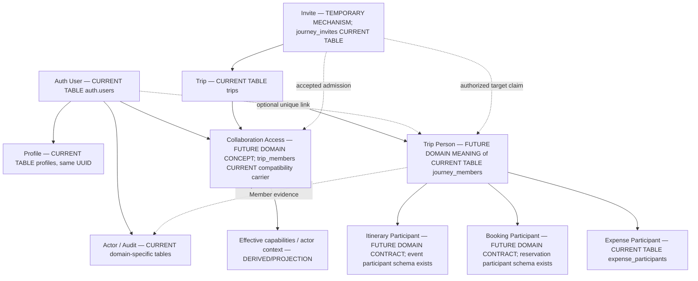

# Trip Canonical A1-D — Identity / Membership Contract

- Status: **A1-D DESIGN COMPLETE — REVIEW PENDING**
- Date: 2026-10-03 (Pacific/Auckland)
- Branch: `integration/ledger-polish-canonical`
- Baseline HEAD: `932086befac3fe0695498ebd3ce709633a5a3924`
- Baseline: [Phase A0 audit](TRIP_CANONICAL_A0_AUDIT.md), committed as `932086b`
- Scope: design only; only this document is created. Workspace was clean.

`CURRENT` means source behavior at this HEAD. `PROPOSED` means a recommendation
for review, not deployed behavior. `UNKNOWN` means insufficient evidence.
MUST/MUST NOT apply to future implementation only after approval. Decision status
`DECIDED` identifies constraints directly required by the request or established
in source; new policy choices are `PROVISIONAL`. Neither authorizes A1-I.
Acceptance PASS below means design coverage, not approval or runtime PASS.

Repository instructions, current handoff, required product/architecture/data/API/
offline/environment/legacy-audit documents, UI Foundation and terminology glossary
were read in this conversation. A0 facts remain baseline. Relevant identity,
permission and claim source was rechecked; no new global or legacy Web audit was
performed. No product, glossary, handoff or ADR file is changed: this phase permits
only this document. Its decision records await architecture review and adoption.

## A. Executive decision summary

Recommend **Option A**: existing `journey_members.id` is the canonical **Trip
Person ID** within `trips.id`. Account identity and Collaboration Access remain
separate concepts. No replacement Member IDs, new person registry, global contact
graph or table consolidation is justified.

Trip Person is an internal design term for the human represented by a Journey
Member. It does not rename stored Member IDs, create UI vocabulary, or redefine
Expense Participant. A person may have only a display name, never join OTR, and
still have valid business relationships and history.

Retain `trip_members` as access compatibility infrastructure. Future effective
access requires explicit read/collaborate/organize semantics and denial precedence.
Current legacy roles and creator bypass cannot safely be relabeled. Preserve
`journey_members.role/status` compatibility until an approved guarded adapter
covers all affected authorization paths.

Separate person participation (active/inactive), account link (unlinked/linked),
and access (granted/revoked with capability level). Leave/revoke changes access;
stopping travel changes participation. Neither deletes the person, clears the
link, removes shares, changes balances or rewrites history. Creator attribution
persists; future confirmed revocation must override creator bypass.

Invites authorize a bounded operation, not identity. Claim requires explicit
Person ID, person-specific authorization and claimant consent; it retains the
Member ID and never automatically promotes Organizer. General join creates a
Person only after an explicit join-as-new choice. Viewer admission creates none.

New claim/access policy and ownership transfer are proposals awaiting review.
Account-switch tooling is **NON-BLOCKING FOR DESIGN; BLOCKING BEFORE A1-I IDENTITY
IMPLEMENTATION ACCEPTANCE**. No A1-I work is authorized by this document.

## B. Current-state constraints inherited from A0

| CURRENT constraint | Evidence | Consequence |
| --- | --- | --- |
| Root is `trips.id`; Ledger `journey_id` points there | A0 E01/E03; S1/S5 | One root UUID, no second Trip root. |
| Member UUID stable, `user_id` nullable; linked/unlinked/invite_pending | A0 E05/E06; S1 | Name-only Person valid; reuse existing identity. |
| Expense Participant is Expense/Member pair and snapshot | A0 E06; S5 | Not the general Person entity. |
| Dual membership roles/access differ | A0 E07; S2/S3 | No automatic merge or role translation. |
| Account keyed by Auth/Profile UUID | A0 E05/E12; S1/S7 | No provider/email account merging. |
| Explicit claim preserves ID and rejects another linked identity | A0 E05; S4 | Stable claim is retained. |
| Invite/email claim searches email; accept includes display-name=email fallback | S4, rechecked detail | Historical matching is not future identity authority. |
| Accept returns already_member before claiming Person for existing legacy membership | S4 | A viewer/member needs a separate explicit claim operation. |
| Removal hard-deletes Member; financial RESTRICT may roll back whole transaction | A0 E05/E14; S4/S5 | Leave/revoke must not use physical deletion. |
| Creator bypass persists after membership removal | S2/S3 | Revocation needs all-path deny precedence. |
| Linked owner is financial Organizer; group_member normally edits own Expense | S3/S5 | Creator/legacy admin/payer not automatically Organizer. |
| Personal Payment grants and Review eligibility are domain-specific | S6 | Trip role cannot replace private authorization. |
| Account scope, actor context, queue ownership and offline bootstrap exist | S7 | Preserve isolation; no network launch dependency. |

Exact source index (repository-relative; SQL basenames elsewhere resolve under
`supabase/migrations/`; no live deployment claim):

| ID | Path and relevant symbols |
| --- | --- |
| S1 | `supabase/migrations/20260910000100_canonical_production_baseline.sql`: `trips`, `profiles_id_fkey`, `journey_members`, unique trip/user and role/status checks, `trip_members`, `journey_invites`, creator triggers |
| S2 | Same baseline: `is_trip_member/is_trip_creator/is_trip_member_or_creator/is_trip_owner_or_admin`, root/Member/itinerary RLS; `supabase/migrations/20260910000200_canonical_security_hardening.sql`: authenticated invite/claim RPC grants |
| S3 | `backend/src/supabaseGateway.ts`: `canReadTrip/canWriteTrip/canFinalizeSettlement/capabilities/readLedgerBootstrap`; `backend/src/app.ts`: `authorizeRead/createEntity` |
| S4 | Baseline: `accept_journey_invite/claim_email_invited_journeys/claim_journey_member/remove_journey_member`, `journey_removed_users` |
| S5 | `supabase/migrations/20260911000100_ledger_2_domain.sql`: financial Member FKs/validation/immutable audit; `20260912000200_ledger_2_stage_4b_mutations.sql`: `ledger_mutate_expense_4b`; `20260912000700_ledger_2_stage_7_1_settlements.sql`: `ledger_finalize_settlement_7_1`; `20260917000600_ledger_journey_currency.sql`: linked-owner/currency guard; `src/domain/ledger/types.ts`; `src/data/repositories/ledgerExpenseEditAccess.ts` |
| S6 | `supabase/migrations/20260922000100_settlement_2_phase_1a_personal_payments.sql`: owner validation, read grants, `ledger_can_read_personal_settlement_payment_1a`; `20260917000100_review_v2_personal_decisions.sql`: eligibility/read projection; A0 E16/E29 for checkpoints/correction lineage |
| S7 | `src/domain/auth/localSession.ts`; `src/data/auth/accountSwitchCoordinator.ts`; `src/data/auth/accountGeneration.ts`; `src/data/bootstrap/bootstrapApplication.ts`; `src/data/db/migrations.ts`: migration 19; `src/data/sync/syncOperationRepository.ts`; `src/data/repositories/ledgerReadRepository.ts`: `applyJourneyContext`; `src/data/repositories/ledgerPersonalPaymentRepository.ts` |
| S8 | Baseline event/reservation participant nullable User/Member FKs; A0 E17; `src/data/auth/accountSwitchFoundation.test.ts`; A0 validation failure |

## C. Canonical vocabulary

| Concept | Meaning / identifier | Does not mean |
| --- | --- | --- |
| Account / User | Authenticated subject; Account ID = `auth.users.id = profiles.id`; local `userId` | Global human identity or provider/email equivalence |
| Profile | Display/account attributes of that UUID | Trip Person or authority based on name/avatar |
| Actor | Account performing an action; optional contextual Member ID | Person owing money or automatically participating |
| Trip / Journey | Scope = existing `trips.id` | New root or schema rename |
| Trip Person | Trip-scoped human, `journey_members.id` | Account, access grant, Expense Participant, global person |
| Participation | Business object → Person relationship | Permission to use the app |
| Collaboration Access | Account → Trip admission/capability | Person existence or travelling status |
| Organizer | Effective organize authority; current finance requires linked owner Member | Creator, legacy admin or placeholder role automatically |
| Creator | Historical root/action attribution | Irrevocable future access |
| Invite | Temporary scoped authorization/discovery mechanism | Person, Account or accepted access grant |
| Claim / link | Explicit Person-to-Account association | Replacing IDs, accepting debt, role promotion or account merge |
| Leave / revoke | Self / Organizer termination of access | Deleting human/history or stopping travel automatically |
| Deactivate | Stop ordinary active selection for new travel participation | Remove historical relationships or unlink Account |

User IDs remain appropriate for Actors, audit attribution, private payment
ownership/read grants, personal Review decisions, secure sessions, local account
scope and durable command ownership. Who paid/owes/participates uses Person/Member
ID. Preserve both where current rows carry both; do not replace every User FK.

“Leon performed this correction” records Actor Account and contextual Member
evidence. “Leon owes Tina NZ$20” references two Member IDs. Name/link/access changes
do not recalculate obligations. Linking may fill missing optional display data but
must not silently replace an established Trip name or frozen Expense snapshots.
The UI glossary and its domain distinctions remain unchanged.

## D. Options considered

| Dimension | A: Member is Person; separate access compatibility | B: Member eventually absorbs access | C: New Person registry beside/above Member |
| --- | --- | --- | --- |
| Ledger compatibility | Direct existing FKs | Direct if retained row never implies access | Every financial reference needs identity mapping |
| Stable identity | UUID unchanged | UUID unchanged only with separate denial axis | Two identities or risky conversion |
| Permission clarity | Explicit separation; reconcile legacy paths | Viewer requires non-traveller Member or exception | Still needs access reconciliation |
| Migration cost | Add lifecycle/access semantics and adapters | Migrate creator/legacy access into Member | Registry/link/backfill and permanent adapter |
| Offline/sync | Extend existing account context/queue | Richer Member/access mirrors and role races | New mirror and sync dependency |
| Booking/itinerary | Same Member ID directly | Same ID, but traveller/viewer conflation risk | New FK plus Member mapping |
| Invite/claim | Explicit stable target; grant separate | Easy accidental claim/role coupling | Resolve Person/Member/Account triple |
| Long-term complexity | Two necessary concepts; one Person key | Fewer table names, more semantic exceptions | Extra layer without established need |
| Reversibility | Additive adapters evolve, IDs stable | Harder after legacy retirement | Difficult after new dependents proliferate |

Recommend A. B does not remove the need for independent viewer/access/retained
Person semantics. C solves no proven identity limitation: nullable link, Trip
scope, stable claim and financial references already exist. No migration for
naming elegance is justified.

## E. Recommended model and decision records

Person key is `(tripId, personId)`, where `personId = journey_members.id`.
Display name required; email/phone/account optional, never keys. One Account may
link to **at most one Person per Trip, including inactive retained Persons**.
This preserves current uniqueness rather than weakening it to active-only.
Rejoin reuses the same Person; different Trips naturally have different Person IDs.

Three independent axes:

- Participation: **active / inactive**. Inactive Person remains resolvable in all
  history, omitted from default new travel selection; explicit reactivation reuses ID.
- Link: **unlinked / linked**. `invite_pending` remains compatibility metadata,
  not a travel state. Revoke must not clear `user_id` or convert to unlinked.
- Access: absent, granted or revoked; effective **read / collaborate / organize**.
  These are conceptual semantics, not new persisted enums/table instructions.

A viewer requires no Person. A Person-less collaborator may edit ordinary Trip
content but cannot execute Member-based Ledger actions until explicitly linked.
Organizer requires a linked Person for current financial compatibility; inactive
travel participation does not automatically demote an Organizer. No generic RBAC
framework or custom role catalog is proposed.

`trip_members` stays the compatibility/access carrier candidate. It is not already
the sole effective authority. `journey_members.role` remains a Ledger compatibility
projection until all paths gate it with effective access. Historical actor roles
are never rewritten. Exact additive storage/adapter version is an A1-I preflight
deliverable after design approval, not SQL supplied here.

| Decision | Current evidence | Reason | Rejected alternative(s) | Compatibility impact | Reversibility | Status |
| --- | --- | --- | --- | --- | --- | --- |
| D1 Keep root and financial Member IDs | S1/S5; explicit request | History addressability | Replacement root/IDs | No financial FK transformation | Concepts evolve without changing IDs | DECIDED |
| D2 Option A: Member is Trip Person | S1/S4/S5 | Existing identity capacity sufficient | B unified access; C registry | Add semantics, preserve IDs/roles | Adapter can evolve | PROVISIONAL |
| D3 Separate access/link/participation | S2/S3 different access paths | Viewers and safe departure | Delete/unlink to revoke | New effective-access predicate | Additive; rollback must preserve denial | PROVISIONAL |
| D4 One Account/Person per Trip; no global Person | Unique trip/user and claim guard S1/S4 | Stable rejoin and no hidden duplicate identity | Active-only uniqueness, name/email graph | No relaxation of current unique link | Separate future approval to relax | DECIDED |
| D5 Claim needs target-specific authority and claimant consent | S4 claim preserves ID; legacy email/name matching | Prevent wrong-person claim | General token claims any placeholder; unilateral account binding | Stricter future claim path, old RPC unchanged now | No ordinary unlink/reassign; explicit remediation later | PROVISIONAL |
| D6 Join never silently grants Organizer; viewer creates no Person | S1 invite roles/S3 finance gate | Prevent escalation/nominal duplication | Inherit placeholder owner; every viewer is traveller | Explicit admission/transfer intent | Explicit grant changes possible | PROVISIONAL |
| D7 Leave/revoke retain identity/history | S4 delete vs S5 RESTRICT; explicit request | Access loss is not identity loss | Hard delete/clear linked User | Durable denial independent of link | Explicit regrant, same Person | DECIDED retention; PROVISIONAL denial policy |
| D8 Creator attribution survives, denial overrides creator bypass | S2/S3 | Revocation cannot be cosmetic | Rewrite created_by; delete membership only | All-path permission cutover required | Unsafe to roll back to bypass after revoke | PROVISIONAL |
| D9 Last effective Organizer protected; atomic transfer | S4 last-owner guard; S3/S5 linked-owner | Reachable management authority | Count unlinked owner rows; owner simply exits | Count effective linked Organizers; preserve existing plural owners | Explicit transfer back, audit remains | DECIDED protection; PROVISIONAL transfer protocol |
| D10 Retain trip_members; no A1-I retirement | S2/S3/S4 consumers | No replacement equivalence proved | Remove after rename | Compatibility adapters/dual-read | May retain indefinitely | DECIDED for scope |
| D11 Delete only never-linked unused accidental Person | S5/S8 financial and business references | Avoid orphaning history | Delete inactive/historical Person | Reference/intent checks and sync deletion proof | Physical delete irreversible; audit retains deleted ID | PROVISIONAL |
| D12 No provider merge | S1/S7 Auth UUID; request | Provider equivalence unproved | Email/provider/name account merge | No Auth configuration change | Separate approved Auth project | DECIDED |

## F. Canonical invariants

| Invariant | Rationale | Current support | Implementation implication | Unresolved issue |
| --- | --- | --- | --- | --- |
| I1 Person needs no Account/email/phone | Nominal traveller valid | S1 nullable User/S5 finance | Name-only create, no invite needed | New action not implemented |
| I2 Read access does not create Person | Viewer distinct | S3 legacy/creator read without Member | Account→Trip viewer only | Viewer authorization cutover review |
| I3 Finance uses stable Member IDs | Names duplicate/change | S5 payer/share/transfer FKs | No financial identity remapping | None in contract |
| I4 Claim retains Member UUID | History continuity | S4 explicit claim | Update optional link, not replace identity/snapshots | Claim authority review |
| I5 Revoke preserves participation/history | Access differs from money | Financial RESTRICT shows deletion limitation | Independent deny; retain link/relationships | Cache/regrant policy review |
| I6 Final history never reconstructs person | Exact final evidence | A0 E14/E29 frozen inputs/lineage | Keep inactive/revoked Person addressable | No financial migration allowed |
| I7 Invites/emails are mechanisms, not IDs | Expiry/delivery not identity | S1 separate invite; legacy matching differs | Explicit target ID and bounded purpose | Binding storage preflight |
| I8 User IDs valid for Actor/private ownership | Auth actor differs from debtor | S5/S6/S7 | Keep Account attribution and private grants | Provider merge excluded |
| I9 Person does not confer permission | Unlinked people cannot act | S3 linked capability gate | Independent effective access | Guard every legacy bypass |
| I10 No second Person claim in same Trip | Avoid hidden duplicate owners | S1 uniqueness/S4 guard | Include inactive rows; rejoin same ID | Reassignment excluded |
| I11 Trip-scoped Person | No social graph needed | Member.trip_id S1 | Different Person IDs per Trip | Cross-trip graph excluded |
| I12 Name/email/provider never replace key | Discovery not identity proof | Stable UUID; current matching exists | No matching-driven new-flow auto-link | Legacy claim deprecation gated |
| I13 Offline/account isolation persists | Token expiry is not logout | S7/A0 D | Account queue/context/generation; known cached denial wins | Runtime tooling blocked |
| I14 Booking/Itinerary uses same Person | Same human across relationships | S8 Member FKs | Future relations reference Member/Trip; Actor separate | No booking schema work now |
| I15 Inactivity does not remove debt/role | Travel stop not financial edit | Finance independent of root dates | Selection semantics only; no split/demotion side effects | Participation storage deferred |
| I16 Old replay cannot undo later revoke | Two devices and stale invites race | S4 protections only partial | Serialized/versioned access; receipt historical, current access separate | Receipt/version storage preflight |

## G. Relationship diagram

This is a semantic contract, not a table plan. Access may have no Person; Person
may have no Account/access. Viewer context may have null Member ID and cannot
fabricate a financial actor. Legacy itinerary `user_id` links remain compatibility
facts, not instructions to rewrite them in A1-I.

## H. Permission/access model

### H.1 CURRENT mapping

| Current role/path | CURRENT behavior | PROPOSED treatment |
| --- | --- | --- |
| trips.created_by | Independent gateway read/write; owner/admin helper; creator-delete RLS | Retain attribution/rights until guarded cutover; thereafter effective access required |
| trip_members.owner/admin | Legacy management; gateway accepts any row for ordinary write | Preserve legacy evidence; admin not automatically financial Organizer |
| trip_members.member/other | Gateway ordinary read/write admission | Cannot call it viewer; explicit compatibility classification |
| linked journey_members.owner | Organizer finance/finalize/currency | Organize + linked Person; role cannot bypass denial |
| linked group_member | Own-Expense collaborator | Collaborate + linked Person for member-based Ledger actions |
| linked guest | Capability read-only; legacy row may still admit ordinary writes | Viewer candidate, not proven read-only across all paths |
| unlinked/invite_pending Member | Nominal human, no authenticated capability from row | Person only; grant separate |
| system/profile admin | Separate legacy administration | No new admin-to-Organizer inheritance |

### H.2 PROPOSED capability matrix

Creator means creator without another effective role. Other columns mean active
Account grant. Existing financial validation/finality remains mandatory. A new
viewer is bounded shared Trip access, not public sharing or access to all private
Ledger/Review data. No unlinked person authenticates as an Actor.

| Capability | Creator only | Organizer | Collaborator | Viewer | Unlinked Person |
| --- | --- | --- | --- | --- | --- |
| Read ordinary Trip | No independent authority | Yes | Yes | Yes | No app access |
| Edit ordinary itinerary | No independent authority | Yes | Yes | No | No |
| Create/update/deactivate Persons | No independent authority | Yes | No | No | No |
| Invite / approve claim / grant access | No independent authority | Yes within authority; no ordinary invite Organizer promotion | No | No | No |
| Claim own targeted Person | Valid targeted authority, as any Account | Same claim rules | Same claim rules | Same rules; no auto-upgrade | Claimant Account acts |
| Edit Expense / Expense participants | Needs effective financial role | Eligible source, existing reason/finality rules | Own eligible Expense only | No | No |
| Correct another Expense | No independent authority | Existing audited path; frozen source requires successor | Suggest as existing domain allows, not apply | No | No |
| Finalize Settlement / change currency | No independent authority | Current source/digest/finality checks | No | No | No |
| View private Personal Payment | Record entitlement only | Existing Organizer/domain entitlement | Owner/counterparty or explicit record grant only | Explicit record grant only; viewer grant insufficient | No app access |
| Revoke others / transfer authority | No independent authority | Yes with last-Organizer/consent guard | No | No | No |
| Leave own access | If currently granted | After replacement if last | Yes | Yes | No access to leave |

CURRENT ordinary reads/writes admit creator/legacy paths (S3); financial SQL has
stricter linked-member/creator rules (S5); Member/invite management uses baseline
owner/admin helper (S2/S4). There is no current Mobile transfer/read-only-viewer
grant feature. Proposed differences are intentional reviewed policy changes, not
claims of current behavior. Existing plural owners are preserved; no new multi-owner
management system is introduced.

### H.3 Access precedence and private boundaries

PROPOSED: after the guarded cutover, confirmed current denial for `(Trip, Account)`
overrides creator fallback, legacy row, linked Person role and stale local grant.
No UI-only deny. Backend routes, service SQL, authenticated RPC/RLS, receipt content
and personal projection paths must evaluate the appropriate common-access guard
without replacing their additional private domain checks.

Ordinary Trip access does not automatically grant Review eligibility or private
Personal Payment access. Existing record-specific read grants remain distinct
entitlements, evaluated separately; they are not deleted by generic leave/revoke.
Retain existing financial/Review history and do not broaden access to viewers.
Revocation must remove general/role-based admission, while any surviving private
record entitlement is determined only by its existing domain policy. Any desired
change to record-grant retention after departure requires separate explicit approval.

The present linked-person role alone grants some private access (S6). Keeping
Person.user_id on revoke therefore requires new effective-access gating of that
role-derived path, while retaining explicit record-grant behavior. This is a
required security compatibility seam, not a money/Review algorithm redesign.

## I. Invite / claim model

All rules in this section are PROPOSED. S4 is the current implementation, not an
implementation of this contract. Invite delivery and screen design are out of scope.

### I.1 Purpose and evidence

An Invite is temporary authority to perform a bounded admission/claim, not a Person,
Account, permanent grant or proof that two people are identical. Three purposes are
sufficient: join as a Person, grant viewer access, and claim an existing Person.
These are domain meanings, not a requirement for three tables or new enum values.
An ordinary invitation can grant at most its explicitly authorized read/collaborate
level. Organizer promotion requires the separate authority-transfer contract.

| Mechanism | Authority and canonical outcome |
| --- | --- |
| Universal Link | Presentation of a token; it can carry any permitted purpose. A general join token does not authorize claiming an arbitrary placeholder |
| QR invite | Another presentation of the same token/intent; no different identity or trust rules |
| Email-associated invite | Email may aid discovery. Advisory email is not an identity key; if email verification is an explicit restriction, acceptance requires the chosen verified evidence |
| Existing-account invite | Restricted to the exact Auth UUID when specified; a different Account fails even if names/emails coincide |
| Targeted Person claim | Bound to the exact Trip and Member ID, with explicit Organizer authority and claimant consent; optionally restricted to an exact Account |
| Join without Person | Explicit join-as-new intent creates one Trip-scoped Person and grants the allowed collaboration access atomically |
| Viewer invite | Grants read access to an authenticated Account; creates no Person and grants no financial participation |

A no-email placeholder can be claimed through a valid targeted token. Alternatively,
the authenticated Account requests the exact Member ID and an Organizer authorizes
that exact Account/Person pairing; this approval and claimant consent are both
required before linking. A generic link that lacks this authority produces a
pending claim request, not an automatic name/email match. This is how Scenario 2
preserves Tina's identity without guessing who Tina is.

For a bearer targeted token, possession plus authentication and explicit consent
is the proposed admission evidence; its forwarding risk must be reviewed. It cannot
convey Organizer authority even if the placeholder has an existing owner role.
An Account restriction overrides bearer possession. Verified-email restriction
must never be silently relaxed because another provider was used. The exact email
verification mechanism is UNKNOWN and is unnecessary for no-email targeted claims.
Do not introduce provider-account merging to make an invitation work.

### I.2 Claim result and conflict rules

1. Authenticate the Actor and validate Trip, target, purpose, restriction, current
   invite validity and current admission authority. Claim is server-confirmed.
2. A live target must be unlinked, or already linked to this Account. Inactive
   Persons can be linked only with explicit authorization; linking does not
   reactivate travel participation.
3. Check uniqueness across all Persons in that Trip, including inactive rows.
   If this Account is linked to a different Person, return a conflict with no
   relink, replacement ID, duplicate creation or implicit merge.
4. If the target is linked to another Account, reject. If the same Account already
   links to this target, return the same canonical Member ID; do not apply a new
   grant unless a currently valid, explicitly authorized grant intent exists.
5. Link preserves the Member ID and every reference. It updates link evidence;
   display name is not automatically overwritten from an Auth profile.
6. Link and access are separate effects. A combined accept operation applies only
   the invite's permitted grant. A viewer claiming a Person remains a viewer
   unless collaborate access is explicitly granted. Claim never promotes owner.
7. A join intent for an Account already linked in this Trip reuses that Person;
   rejoining may reactivate it only by an explicit participation action. If the
   Account has no link, it must explicitly choose authorized claim or join-as-new.
   Similar names/emails never select or merge Persons.
8. A wrong-person claim reported after success is disputed, not ordinary unlink.
   Prevent further link reassignment and preserve all finance and attribution.
   Recovery/administrative correction requires a separately approved contract;
   this phase does not invent reassign/merge/delete behavior.

An Organizer may create a placeholder without claimant consent because this creates
business participation, not Account identity/access. The Organizer may not silently
link a known User merely because an email or display name matches. Account consent
is required for the link.

### I.3 Replay, expiry, concurrency and revocation

Each mutating intent requires a durable idempotency scope including Trip, Account
and action. The same key with a changed target/purpose is a conflict, not a second
operation. Exact storage and receipt shape are deferred to A1-I design approval.

Concurrent acceptance of the same intent from two devices of one Account yields
one Person/link/admission result and one quota consumption. Distinct Account
acceptances of a universal multi-use invite each consume one authorized admission;
a targeted single-Person claim can succeed for only one Account. Target uniqueness,
invite quota, grant application and durable result must be serialized/atomic at the
server authority. Do not implement them as independent best-effort writes.

An expired/revoked invite cannot authorize a new admission. Replaying an already
committed receipt can report its historical success, but must separately report
current effective access; it must never restore a revoked grant or consume another
use. A new mutation attempt checks current authority even if a local receipt says
success. An Account that left or was revoked requires a new explicit Organizer
regrant for that Account after the denial; an old or newly created generic bearer
invite cannot bypass the denial. The existing removed-user marker behavior is
compatibility evidence, not sufficient authority/version semantics by itself.

Acceptance racing invite revocation or Account-access revocation is ordered at
the authority boundary: a prior committed admission can subsequently be revoked;
an admission ordered after revocation fails without side effects. A1-I must prove
the same ordering for replay and concurrent leave/transfer operations.

Offline invitation/claim preparation may be a draft, but cannot confer effective
access, link a User or mint a successful server receipt. Ordinary permitted local
business writes retain the existing offline model; do not expand the queue during
this design phase or let a provisional link authorize financial writes.

## J. Leave / remove / revoke model

PROPOSED: use independent Person participation and Account-access axes. Do not
add a single overloaded `LEFT`/`ACCESS_REVOKED` Person status. Current `status`
describes linking and cannot safely absorb both axes unchanged.

| Intent | Effect | Identity/history and physical deletion |
| --- | --- | --- |
| A. User leaves collaboration | Revoke their general Account grant; self-service, with last-Organizer guard | Keep link, Person ID, financial and other historical participation; do not assume they stop travelling |
| B. Organizer revokes access | Revoke target Account's general grant and role-derived access | Keep Person/link/history; record who revoked and why; do not silently deactivate travel |
| C. Person stops travelling | Mark Person participation inactive; prevent default selection for new participation | Keep prior itinerary/booking and finance; does not automatically revoke Account access |
| D. Historical Person | Addressable by the same Member ID, including inactive/revoked cases | Expense, Settlement, Review, payment and audit references remain valid; no hard delete |
| E. Accidental unused placeholder | First enforce the strict unused rule below | True deletion may be allowed; no deletion merely because access was removed |
| F. Organizer leaves | Relinquish authority and revoke own grant only after replacement is effective | Creator attribution and historical Actor IDs remain; no rewriting of origin |
| G. Last Organizer | Reject removal/demotion/leave that leaves no effective Organizer | Applies across concurrent operations, not just a stale count of owner labels |

UI wording and combined commands are outside scope. A future combined operation
must state both independent effects and satisfy both contracts. An unlinked Person
cannot leave Account access; it has none. A viewer without a Person may leave their
grant. A former traveller may remain Organizer if linked and authorized: travel
participation does not determine administrative responsibility.

### J.1 Physical deletion

Normal remove/departure MUST NOT execute `DELETE journey_members`. Physical
deletion is prohibited for any Person with financial, booking, itinerary, payment,
Review, snapshot, meaningful audit/history references, past Account linking or
outstanding claim/invite/local write intents. A reference count of live Expenses
alone is insufficient. Unlinking an Account does not make a Person unused.

A never-linked accidental placeholder with no such references or meaningful
history can be deleted by an Organizer. Retain minimal create/delete provenance
identifying the deleted UUID; this provenance alone does not manufacture financial
history or permit ID reuse. The ID must never be recycled. Pending targeted invites
must first be revoked and outstanding intents resolved. The server must prove no
reference/deletion race; offline replicas must stop creating references to that ID
before irreversible purge. Until A1-I supplies a proven tombstone/sync safeguard,
deactivate the placeholder and defer physical purge. Deletion is unnecessary for
departure and unnecessary to complete A1-D; existing RESTRICT checks are a final
safety barrier, not a lifecycle strategy.

### J.2 Ownership and creator authority

An effective Organizer is a linked Account/Person with current organize authority
that is not revoked. Preserve existing plural owners; introduce no co-owner
product feature. If one effective Organizer remains, they cannot leave, be revoked,
or relinquish authority until a successor is confirmed. Count effective authorized
accounts, not unlinked `role = owner` placeholders or creator fallback.

Transfer requires an existing effective Organizer, an exact recipient Account and
its Trip Person, and recipient acceptance of Organizer responsibility. An unlinked
target first completes a separately authorized claim. Authority is transferred
atomically with the acceptance/last-Organizer check; do not leave a zero-authority
interval. The outgoing Organizer keeps or relinquishes collaborator access only
as explicitly requested; transfer alone does not delete their Person or history.
Transfer to an already-authorized Organizer is an idempotent no-op for that grant,
but relinquishment still checks effective remaining authority.

`trips.created_by` remains immutable provenance. Under proposed D8 it provides no
independent access after confirmed denial. Existing Trips with no effective linked
Organizer need explicit reviewed repair before this policy is enabled. Do not
silently promote a guessed Account during backfill. Transfer is a new domain
contract, not a claim that the current RPC already supports it.

### J.3 Offline and cached access

Network unavailability/token expiry alone is not a confirmed Trip denial and
must not block valid cached local sessions. When a server denial becomes known,
shared Trip navigation/read/write admission and role-derived private projections
must close for that Account/Trip. Preserve protected historical cache/queued intent
ownership for reconciliation; no automatic queue reattribution, destructive purge,
or global logout caused by one Trip denial. Do not expose protected retained data
through stale screens, search, attachments or alternate projections.

Pending writes created under prior authority remain attributed to their original
Account and generation. A permission rejection stops their automatic submission;
resolution/discard requires the existing safe recovery boundary, not replay under
another Account. A surviving explicit private-record grant is evaluated through
its domain contract (H.3), not restored shared Trip access. The exact cache-lock
and revocation freshness mechanics require A1-I validation; no offline promise of
instant remote revocation while a device cannot receive server evidence is made.

## K. Required domain actions

PROPOSED conceptual boundaries only. Reuse existing repository/backend command
patterns; no universal Action Layer, generic command bus or new framework. Every
mutation retains authenticated Actor UUID, Trip ID, target IDs, outcome and relevant
before/after authority/link evidence. Audit never logs bearer token secrets. Rejected
security-sensitive claims need traceable outcome without leaking another Account's
private data. Audit retention/storage details remain an implementation decision.

| Action | Actor / target | Preconditions and permission boundary | Canonical result | Idempotency / audit |
| --- | --- | --- | --- | --- |
| createTripPerson | Organizer / new Trip-scoped Person | Effective organize access; valid minimal display identity | Stable Member ID, unlinked active Person; no access grant | Stable creation intent creates once; Actor/create evidence |
| updateTripPerson | Organizer / exact Member ID | Same Trip; editable display metadata; no ID/link/role mutation hidden here | Metadata only; existing references unchanged | Same intent/result; before/after metadata |
| inviteToTrip | Organizer / Trip and bounded intent | Authority to invite at requested level; explicit target/restrictions where applicable | Temporary Invite; no link or grant yet | One issuance per intent; purpose/target/expiry evidence, no token secret |
| acceptInvite | Authenticated Account / Invite | I.1–I.3 authority, restriction, expiry/quota and revocation checks | Bounded join/claim/view grant atomically; stable Person if needed | Durable outcome, quota once; Actor/Invite ID/result IDs |
| claimTripPerson / linkAccount | Claimant Account / exact Member | Explicit targeted authority and consent; uniqueness; no competing link; J last-Organizer implications if any | Same Member ID linked; access only through separate authorized intent | Repeat same link is stable; claim authority/conflict evidence |
| joinTrip | Authenticated Account / authorized join intent | Valid invitation or explicit approved admission; no automatic placeholder guessing | Reuse own linked Person or explicit create-as-new; bounded grant | One Person/admission per intent; no name-based merge |
| grantTripAccess | Organizer / exact Account | Read/collaborate authority; regrant after denial explicit and newer; organize uses transfer contract | Current Account grant independent of Person | Ordered grant version/outcome; who authorized which level |
| revokeInvite | Organizer / exact Invite | Effective organize access in Trip | Future acceptance disabled; committed history untouched | Repeated revoke safe; authority/ordering evidence |
| revokeTripAccess | Organizer / exact Account | Effective authority; last-Organizer guard; no implicit Person delete | General/role-derived access revoked; private grants follow H.3 | Repeat safe; denial ordered against admissions and transfer; reason/Actor |
| leaveTrip | Account / own Trip access | Authenticated self; J.2 when Organizer | Own grant revoked, link/history retained | Repeat safe; departure outcome and original Actor |
| transferOwnership | Organizer and consenting recipient / exact Account+Person | Recipient linked in same Trip; effective authority; acceptance and last-Organizer check atomic | Effective Organizer responsibility moved; optional outgoing grant change explicit | Transfer/acceptance intent once; both Actors and authority transition |
| deactivateTripPerson | Organizer / exact Member | Same Trip; current authority | Participation inactive only; prior references and link retained | Repeat safe; participation transition evidence |
| reactivateTripPerson | Organizer / exact Member | Same Trip; current authority; no implicit grant | Active participation; same Member ID | Repeat safe; participation transition evidence |
| deleteUnusedTripPerson | Organizer / exact Member | Strict J.1 proof, no pending/racing references; never linked | Deleted unused identity or deferred purge with inactive/tombstone protection | Repeat reports prior outcome, never recreates; retained minimal deletion evidence |

Offline authorization for these new security/lifecycle actions is not granted by
this contract. Person creation/metadata can later reuse local-first repositories
when their queue, server validation and deletion-race handling are approved.
Financial actions stay in their existing domain and are not folded into this list.

## L. Compatibility / migration strategy

Design only; no schema change or executable migration is supplied. The minimum
safe evolution is additive and staged. Preserve `trips.id`, `journey_members.id`,
all Member references and Auth Actor UUIDs throughout; no replacement identity
backfill, financial remap, finalized-data rebuild or calculation change.

| Stage | Required proof / compatibility behavior | Exit boundary |
| --- | --- | --- |
| 0. Review/preflight | Approve provisional policies; inventory exact current authority consumers from A0 and affected code; repair relevant test execution; classify contradictory creator/legacy/member grants | Human authorizes narrowly bounded A1-I; no implementation from A1-D alone |
| 1. Additive representation | Specify participation/access/link intent evidence, ordering and receipts with existing repository patterns; preserve existing IDs/columns and deny visibility; define account-scoped local projection | Exact schema/API proposal reviewed; deterministic backfill without guessed links |
| 2. Compatibility/shadow evaluation | Compare intended effective access against creator/legacy/Member/RLS/backend paths; centrally coordinate compatibility writes; test private grant exceptions, concurrency and offline isolation | Every divergence understood; no broad OR fallback that reopens revoked access |
| 3. Guarded cutover | Enable reviewed shared-access authority consistently in backend, authenticated SQL/RLS, service functions and local capabilities; enable leave/claim/transfer only with ordering proofs | No alternate bypass; existing financial rules plus new access gate pass relevant tests |
| 4. Lifecycle rollout | Activate participation changes and separately proven unused deletion; preserve stable historical lookup and old-client safety | No identity purge until sync/reference-race proof; retirement remains a separate decision |

Likely additive requirements are participation state, explicit effective-access
state/version, targeted invite purpose/restriction, and durable claim/grant outcome
evidence. These are information requirements, not approved columns/tables. Existing
`status`/`role` cannot simply be renamed without adapting current consumers.
Compatibility adapters/views may be useful only where an actual consumer needs
them; do not add them preemptively. A1-I must specify exact persistence first.

Backfill may map existing stable IDs and observed grants. It must not infer links
from matching names/emails, merge providers or turn every legacy member/admin into
an Organizer. Existing orphan/conflicting grants or an owner placeholder require
explicit classification/repair, not invented authority. Snapshot/history references
remain immutable. Existing active linked owners retain their supported authority
when valid; ambiguous legacy `admin` mapping is PENDING review.

Dual-read, if used, is temporary shadow comparison or a reviewed adapter, not an
unrestricted union of old and new access. Dual-write, if needed, is coordinated at
one server authority boundary with idempotency/transaction guarantees. Feature
modules must not independently maintain both tables. Rollback may disable a new
feature, but must not discard known denial evidence and restore creator/legacy
bypass for a revoked Account. Security-sensitive cutover needs a safe rollback
plan before rollout.

### L.1 `trip_members` disposition

**A. Current dependencies:** creator insertion trigger, `is_trip_member` and
owner/admin helpers, broad content RLS, backend general Trip reads/writes,
invitation acceptance, claim admission/projection and removal (S1–S4). Presence
currently grants some write paths irrespective of role. This table is not proven
to be a pure cache or solely authoritative access store.

**B. Why Person cannot replace it now:** linked Person financial roles do not
encode authenticated Person-less viewers, independent revoke/participation axes,
creator denial precedence or all legacy admin/member meanings. Current business
functions still depend on both tables. Deleting legacy membership alone does not
remove linked-person/creator authority.

**C. Retirement evidence:** all backend/RPC/RLS/trigger/content/private-domain
consumers and supported clients must use approved access authority; backfilled
grants and denials must be reconciled; invites, claim, revoke, transfer, replay,
private record exceptions and account isolation must pass; no remaining financial
or admission behavior can depend on this table. A separately reviewed migration,
old-client/deployment compatibility and safe rollback plan would be required.
None of that is established by A1-D, and no remote access is needed to state it.

**D. Recommendation:** retain `trip_members` indefinitely unless concrete evidence
justifies retirement. It may evolve into the access representation/projection,
but selecting sole-authority storage is PROVISIONAL, not asserted current fact.
Do not merge, rename or deprecate either table in A1-D or automatically in A1-I.

### L.2 Domain compatibility checklist

| Domain | Preserved contract |
| --- | --- |
| Expense | Payer/member and `(expense_id, member_id)` identity, shares, actor/provenance, correction/finality rules |
| Settlement | Member endpoints, balances/transfers/history, finalized snapshots, digests and generation semantics |
| Personal Payment | Owner/counterparty Member links, authenticated ownership and explicit private-record grants; no viewer broadening |
| Review | Member eligibility/source references, Account-private decisions and immutable audit; no relinking decisions to a different Account |
| FX / currency | Existing integer money, currency/FX/finality behavior; no new conversion/recalculation policy |
| Booking / itinerary | Future participation can reference the same Member ID; current optional legacy User references require explicit compatibility mapping, not automatic replacement |
| Actor / audit | Auth UUID remains provenance even after departure; no rewriting historical actors from current Person link |
| SQLite / sync | Account+Trip scope, ownerUserId, account generation, durable operation ownership and private projections preserved; no queue reassignment |

## M. Scenario walkthroughs

These are deterministic proposed results, not new endpoint response schemas.
Authority/consent missing means a pending request with no mutation, not guessed
identity. No scenario grants permission merely from travel participation.

| # | Scenario and input | Canonical result | Conflict / replay / historical boundary |
| --- | --- | --- | --- |
| 1 | Organizer creates Tina without account/email/invite | Create Member T in this Trip, unlinked and active; business participation may use T | No app access required. Current Ledger supports T; future booking/itinerary use the same T without implementing their schemas here |
| 2 | Tina signs in via Universal Link; existing T | Targeted T claim authority + consent links her Account to T; authorized grant separate | Generic link alone creates a pending exact-T authorization request. No replacement T; all shares, settlements and booking references retain T. Other Account/Person links conflict |
| 3 | Person never joins | Member remains unlinked, fully valid for business/finance | No invitation/account mandatory; departure can deactivate participation without deleting history |
| 4 | Invite known existing Account U | If U already links to T in Trip, reuse T; otherwise explicitly target a placeholder claim or offer explicit join-as-new with consent | Do not auto-link by email. Target T while U links elsewhere is conflict; no silent duplicate or merge |
| 5 | Join invite, no pre-created Person | Explicit join-as-new creates one Member J and allowed grant in one committed admission | Two devices/replay produce same J and quota once; viewer-purpose invite instead creates only access |
| 6 | Two Davids | D1 and D2 remain distinct UUIDs; relationships and claim targets use exact IDs | Name match cannot select, merge or resolve conflict; presentation disambiguation is future UI work |
| 7 | Different login email/provider from invitation association | Advisory-email valid targeted token + consent can claim exact target; Account-restricted token requires exact U; verified-email-restricted token requires its explicit evidence | No email/provider merge. Missing required restriction evidence rejects; generic token cannot claim a placeholder by email equality |
| 8 | Tina leaves with Expenses/balance/payment/itinerary | Revoke Tina Account's common access; retain T, link and all participation/financial history | Private role-derived access closes; existing explicit record grants follow their own contract. No Person delete or money recalculation; leave does not assume travel inactive |
| 9 | Organizer removes Tina from active collaboration | Revoke exact Account access with audit/last-Organizer guard | T, finalized Settlement and Review/audit remain. Deactivate participation only through separate explicit intent |
| 10 | Bob accidental never-linked placeholder; no references/history/intents | Eligible for strict unused deletion after safe sync/reference proof; otherwise inactive/deferred purge | Any reference/link/history/pending intent blocks physical deletion. Never reuse Bob's UUID; do not claim current removal RPC already implements this |
| 11 | Last Organizer wants to leave | Consenting linked successor obtains effective organize authority before atomic outgoing relinquishment/leave | Without accepted successor reject. Concurrent departures cannot both remove the last authority. `created_by` and historical Actor UUID persist without access bypass |
| 12 | Leon in Trip A and B | One Account U links to Person LA in A and LB in B; intentionally different IDs | Unique `(Trip, U)` per Trip including inactive; no global Person/contact graph |
| 13 | Authenticated non-travelling read-only viewer | Grant common read access to U; no Person row required | No editing/financial membership/private entitlement from viewer grant. Later explicit claim can link T without automatically upgrading grant; no public sharing |
| 14 | Device switches between two cached Accounts while offline | All Person projections, capabilities, Review decisions, private payments and queued operations remain under originating Account+Trip/generation | No cross-account reads or queue replay/reassignment. Offline token expiry alone does not revoke local trust. Known Trip denial gates access; relevant isolation tests must execute before implementation acceptance |

## N. Risks

| Risk | Evidence / impact | Required response before affected implementation |
| --- | --- | --- |
| Creator/legacy/member bypass | S2–S4 permit multiple admission paths; a single-table revoke is insufficient | All-path deny precedence and shadow comparison; creator remains provenance |
| Wrong placeholder claim / forwarded token | Current matching includes email/name heuristics (S4); bearer tokens can be forwarded | Exact Member target, consent, restrictions and durable evidence; approved dispute recovery separate |
| Financially destructive removal | Current physical deletion meets RESTRICT/history (S4/S5) | Separate revoke/deactivate; never hard-delete referenced or formerly linked Persons |
| Owner label mistaken for authority | Unlinked owner placeholder and divergent legacy roles | Count effective linked authorized Organizer Accounts; no automatic claim promotion |
| Concurrent acceptance / transfer / leave | Uniqueness alone cannot serialize quota, denial and last-Organizer checks | Atomic authority-bound ordering and idempotent receipts; relevant race tests |
| Private access after revoke | Linked Person role and record grants are independent sources (S6) | Gate role-derived access, retain domain-specific explicit grants, review policy before cutover |
| Offline stale grants / delete races | Account-scoped queues/caches (S7) may retain old intent | Preserve ownership, close known-denied projections, reject obsolete mutations, defer purge |
| Legacy admin/viewer ambiguity | Legacy presence grants broad current write access; no current viewer product contract | Explicit reviewed role mapping and migration divergence report; do not claim a current read-only path |
| Auth account deletion | Profile/User FKs have deletion behavior but financial provenance requirements persist | Separate account-deletion review; no provider merging or ordinary link reassignment in this phase |
| Unexecuted account-switch tests | A0 toolchain cannot parse React Native Flow before suite execution | Repair/run relevant tests before identity implementation acceptance; no fix in A1-D |

## O. Unknowns and review decisions

The proposed minimum model is evaluable from repository evidence. Unknowns below
do not require inventing identity, accessing remote data or implementing a proof
in A1-D. None authorizes table retirement. They bound review and future scope.

| Item | Status | Why unresolved / required decision |
| --- | --- | --- |
| Option A adoption | PROVISIONAL / PENDING | Evidence favors evolution; human architecture review must approve canonical meaning and access separation |
| New viewer and Person-less collaborator policy | PROVISIONAL / PENDING | Proposed minimal rules are explicit in E/H/M; product authority, not existing source, approves these new access semantics |
| Creator denial, departure and private-grant retention | PROVISIONAL / PENDING | Proposed behavior reconciles paths without deleting history, but changes current role-derived admission and needs explicit review |
| Targeted bearer claim and consent, no automatic Organizer promotion | PROVISIONAL / PENDING | Exact proposed authorization is in I; review forwarding risk and targeted-account restrictions |
| Ownership transfer / effective last-Organizer policy | PROVISIONAL / PENDING | Existing owner guard supports intent, not atomic recipient-consent transfer; review new contract |
| Legacy admin and conflicting grant mapping | UNKNOWN / PENDING | Roles differ across paths; exact migration classification must be reviewed, not silently normalized |
| Exact access authority storage, receipts and local projection | UNKNOWN / PENDING | Tables versus additive fields/adapters must be chosen against actual A1-I slice; no schema mandate here |
| Verified-email restriction proof | UNKNOWN / PENDING | Provider/account configuration not established. Defer restricted flow until proof exists; no-email targeted claims remain defined |
| Disputed claim / account deletion / link reassignment recovery | UNKNOWN / PENDING | Not normal membership lifecycle. Separate reviewed remediation; no ordinary unlink/reclaim or financial identity remap |
| Unused Person purge and old-client sync safety | PROVISIONAL / PENDING | Eligibility defined; exact tombstone/purge/race proof deferred. Default deactivate instead of deleting |
| Account-switch test execution | BLOCKED for A1-I acceptance | Known pre-execution React Native Flow parsing failure; not a design blocker |

If later evidence contradicts root/Member identity, requires provider merging,
reveals irreconcilable ownership semantics or makes remote data/implementation
necessary to choose the model, stop and report rather than filling a gap with an
assumption. Current contradictions are explicitly handled as future policy seams;
they do not prove current permissions already satisfy this contract.

## P. A1-I implementation boundary

**A1-D DESIGN COMPLETE — REVIEW PENDING.** Human review must separately authorize
A1-I and select an implementation slice. This document is not permission to change
schema, SQL, application code, tests or configuration.

Eligible future scope, only after authorization: exact additive identity/access
representation; central repository/backend admission and link contracts; bounded
invite/claim, leave/revoke/transfer and participation actions; necessary compatible
local projections/queue handling; narrow related tests and documentation. A1-I
must first resolve the affected O review items, inventory all relevant permission
paths and define rollout/rollback. Do not bundle every action into one first slice.

Preserve stable identity and existing Ledger/Settlement/Review/FX business rules.
Access-gate changes require explicit approval and compatibility validation; they
are not permission to redesign financial domains. No automatic retirement/merge
of `trip_members`/`journey_members`, new Trip root or global identity registry.

Account-switch tooling is recorded exactly as:

**NON-BLOCKING FOR DESIGN; BLOCKING BEFORE A1-I IDENTITY IMPLEMENTATION ACCEPTANCE**.

`src/data/auth/accountSwitchFoundation.test.ts` currently fails before execution
because the toolchain cannot parse React Native Flow syntax, as recorded by A0.
It was not fixed or rerun in A1-D. A later identity/account/membership implementation
cannot receive FULL PASS until relevant account-switch/isolation tests execute
successfully. A0's successful other suites do not substitute for this evidence.

Non-goals: itinerary UI, booking schema, credential system, artifact redesign,
Pool, Flexible Blocks, general Import, AI, public Trip website, contact book,
social graph, messaging/chat, provider merging, payment integration, global Person
identity, navigation and notifications. No device build or database test is required
solely for this design document. No Production access, Hosted Dev mutation, deploy,
migration or A1-I implementation occurred.

## Q. Acceptance matrix

PASS means a constraint has evidence or a defined compatible contract; it never
means implementation passed. PENDING means human approval or an unresolved product
decision remains. The proposed behavior can be complete enough to review while its
adoption remains PENDING. BLOCKED is reserved for a blocking required dependency.

| # | Criterion | Evidence / design section | Result |
| --- | --- | --- | --- |
| 1 | Canonical Account/User meaning | B/C: Auth/Profile UUID; Actor versus Person | PASS |
| 2 | Canonical Trip Person meaning | C/E/F: Trip-scoped stable Member; optional Account | PASS |
| 3 | Decision whether journey_members represents Trip Person | D/E D2: Option A recommended, adoption requires review | PENDING |
| 4 | Expense Participant remains separate | B/C/G/L.2: Expense-specific `(expense_id, member_id)` | PASS |
| 5 | Collaboration separated or justified unification | D/E/H: separation defined, new policy awaits approval | PENDING |
| 6 | trip_members future role | E D10/L.1: retain compatibility/access representation; no retirement | PASS |
| 7 | Stable Member IDs preserved | E D1/F/I/L/M: no identity replacement | PASS |
| 8 | Unlinked participant supported | B/C/F/M1/M3; nullable user_id current | PASS |
| 9 | Later account claim without identity replacement | I/M2 define targeted authority/consent and same ID; policy approval outstanding | PENDING |
| 10 | Join without precreated Person defined | I.1–I.3/K/M5: explicit create once; viewer exception | PASS |
| 11 | Duplicate-name behavior defined | F/I/M6: distinct UUIDs, no name matching | PASS |
| 12 | Invite not canonical identity | C/G/I: temporary bounded authority | PASS |
| 13 | Access and travel participation distinguishable | E/F/J: independent participation/link/access axes | PASS |
| 14 | Leave / revoke / remove semantics | J/M8/M9: separate explicit effects; creator/private access policy approval outstanding | PENDING |
| 15 | Historical finance preserved after departure | F/J/L.2: same Member references and finalized history | PASS |
| 16 | Unused placeholder deletion rule | J.1/K/M10: strict eligibility; deactivate/defer until sync proof | PASS |
| 17 | Ownership transfer / last-owner rule | J.2/K/M11: effective authority and recipient consent; new policy approval outstanding | PENDING |
| 18 | Read-only viewer resolved | E/H/I/M13: proposed authenticated Person-less read grant; product approval outstanding | PENDING |
| 19 | Booking/Itinerary reference same Person | F/G/L.2/M1: Member ID contract, no schema implementation | PASS |
| 20 | Direct User-ID Actor/provenance supported | C/F/G/L.2: retain authenticated Actor/private ownership | PASS |
| 21 | No email/name/provider normalization | B/F/I/M6/M7: no matching identity keys/provider merge | PASS |
| 22 | No cross-trip global Person graph | C/F/M12/P: Trip-scoped IDs | PASS |
| 23 | Existing Ledger/Settlement/Review/FX semantics preserved | B/F/H.3/L.2/P: stable references/calculations; separately reviewed access gate | PASS |
| 24 | Offline/account-isolation invariants preserved | F/J.3/L.2/M14/P: scoped projections/queues; implementation test gate explicit | PASS |
| 25 | Additive compatible migration strategy | L: phased representation/shadow/cutover; no destructive remap | PASS |
| 26 | A1-I scope clearly bounded | O/P: separate authorization, affected prerequisites, no implementation now | PASS |
| 27 | Unknowns explicit | E decision statuses/O risk and review ledger | PASS |
| 28 | No application/schema/test/config modification | Document-only delivery; completion git status/diff validation | PASS |
| 29 | No remote environment mutation | A/P and task execution: local source reads/document write only | PASS |

Matrix summary: **23 PASS, 6 PENDING, 0 BLOCKED for the 29 A1-D criteria**.
Therefore this is not FULL PASS or implementation authorization. Supplementary
implementation gates remain: O's storage/admin/email/recovery/purge items PENDING
when their slice needs them, and account-switch execution BLOCKED before A1-I
identity acceptance. Design review can proceed without remote inspection or a
toolchain fix. Completion validation is document structure/source-reference
inspection, `git diff --check`, and `git status --short`, including whitespace
validation of this new untracked document; no source/test/config/migration changes.

**STOP — do not begin A1-I.**
